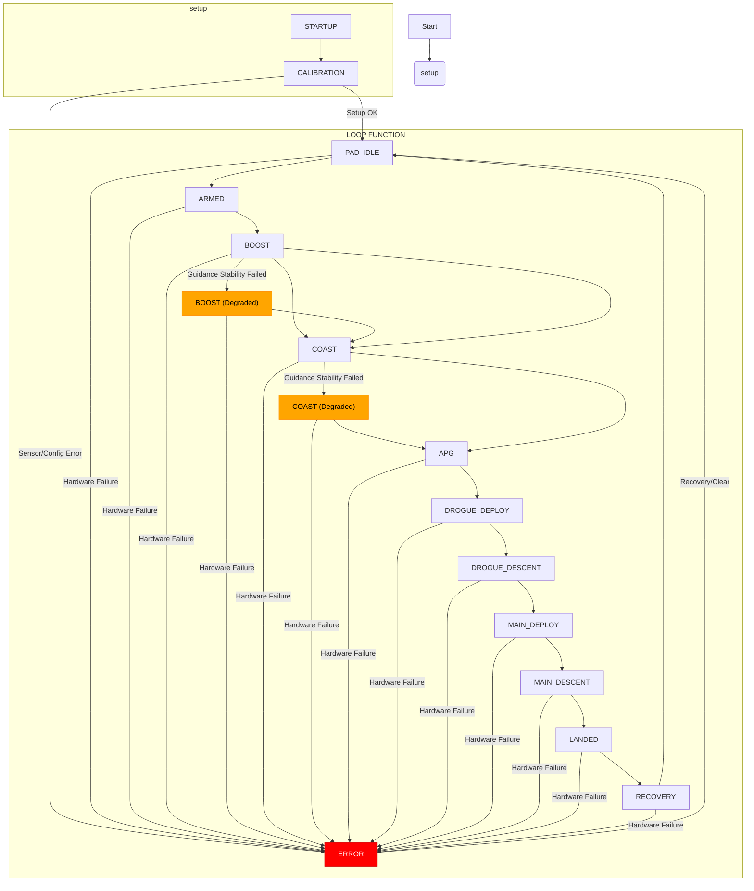

# TripleT Flight State Machine & Operations

**Version:** v0.51
**Last Updated:** February 14, 2026

---

## Overview

This document provides comprehensive coverage of the TripleT Flight Controller's state machine design, implementation details, and operational procedures. The state machine manages the entire flight sequence from initialization through landing and recovery, with appropriate sensor monitoring and recovery system deployment.

---

## Flight State Machine

The firmware operates on a 14-state flight state machine that manages all phases of rocket flight from startup to recovery.

### State Flow Diagram



**Linear State Flow:**
```
STARTUP → CALIBRATION → PAD_IDLE → ARMED → BOOST → COAST → APOGEE →
DROGUE_DEPLOY → DROGUE_DESCENT → MAIN_DEPLOY → MAIN_DESCENT → LANDED → RECOVERY

                                    ↓ (on critical hardware failure only)
                                  ERROR

BOOST/COAST can enter Degraded Mode (guidance disabled, orange LED)
                                    ↓ (continues flight normally to APOGEE)
                                  continues to next state
```

---

## Arduino Framework Alignment

The state machine is implemented within the Arduino framework:
- **`setup()`**: Handles the `STARTUP` and `CALIBRATION` states.
- **`loop()`**: Manages all flight states from `PAD_IDLE` through `RECOVERY`, and handles `ERROR` states and degraded mode.

**Error State Handling (Critical Hardware Failures Only):**
The `ERROR` state is entered **ONLY** from critical hardware failures such as:
- Sensor communication lost (I2C error)
- Watchdog timer reset triggered
- Fundamental hardware malfunction

The `ERROR` state is **NOT** entered for guidance system failures. The system will attempt to enter a safe mode and recover. Depending on the error's nature and system configuration, it might attempt automatic recovery or require manual intervention (e.g., via a serial command to clear errors and return to `PAD_IDLE`).

**Degraded Mode Handling (Guidance System Failures):**
When the guidance system detects a stability failure (angular rate or attitude error exceeding limits), the system enters **Degraded Mode** instead of ERROR:
- `g_guidance_active` set to false
- Fin servos centered to neutral position
- LED changes to orange
- Flight continues normally to apogee and beyond
- Apogee detection, parachute deployment, and landing detection unaffected

This separation ensures that guidance failures do not prevent critical safety functions.

---

## State Definitions

### State Definition in Code

The `FlightState` enum is defined in `src/data_structures.h`:

```cpp
// In src/data_structures.h
enum FlightState : uint8_t {
  STARTUP,        // Initial state during power-on
  CALIBRATION,    // Sensor calibration state
  PAD_IDLE,       // On pad waiting for arm command
  ARMED,          // Armed and ready for launch
  BOOST,          // Motor burning, accelerating
  COAST,          // Unpowered flight upward
  APOGEE,         // Peak altitude reached
  DROGUE_DEPLOY,  // Deploying drogue parachute
  DROGUE_DESCENT, // Descending under drogue
  MAIN_DEPLOY,    // Deploying main parachute
  MAIN_DESCENT,   // Descending under main
  LANDED,         // On ground after flight
  RECOVERY,       // Post-flight data collection
  ERROR           // Error condition
};
```

---

## State Descriptions

### 1. STARTUP
**Initial power-on and hardware initialization**

- Hardware component initialization
- Sensor health checks
- EEPROM state recovery (if applicable)
- LED: Dim white
- Duration: ~2-5 seconds

**Requirements:**
- Power-on reset
- Basic hardware functionality

**Transitions:**
- → CALIBRATION: When all sensors initialize successfully
- → ERROR: On critical hardware failure

---

### 2. CALIBRATION
**Waiting for barometer calibration with GPS**

- GPS time synchronization
- Barometer ground level calibration
- System readiness checks
- LED: Blue
- Duration: Variable (GPS fix dependent)

**Requirements:**
- GPS fix (Type ≥ 2, pDOP ≤ 5.0)
- MS5611 barometer functional
- ICM-20948 IMU operational

**Transitions:**
- → PAD_IDLE: When barometer calibration completes
- → ERROR: On sensor failure or calibration timeout

**Implementation Notes:**
- Waits for `g_baroCalibrated` to become true (via `calibrate` command)
- Periodic status messages printed every 5 seconds

---

### 3. PAD_IDLE
**Ready state, waiting for arm command**

- Continuous sensor monitoring
- Ready to accept arm command
- Background data logging preparation
- Sets `g_launchAltitude` reference
- Resets flight metrics
- LED: Green
- Duration: Indefinite (user controlled)

**Requirements:**
- All sensors operational
- Barometer calibrated
- SD card ready (if logging enabled)

**Transitions:**
- → ARMED: On `arm` command (if sensor health OK)
- → ERROR: On sensor failure

---

### 4. ARMED
**Armed and ready, monitoring for liftoff**

- Active launch detection monitoring
- Enhanced sensor sampling rates
- Pyro channel safety checks
- Calculates `g_main_deploy_altitude_m_agl` (dynamic main deployment altitude)
- LED: Yellow
- Duration: Until launch or disarm

**Requirements:**
- All critical sensors healthy
- Launch detection threshold monitoring
- Pyro channel continuity (if equipped)

**Transitions:**
- → BOOST: When acceleration > `BOOST_ACCEL_THRESHOLD` (default: 2.0g)
- → PAD_IDLE: On timeout or manual disarm
- → ERROR: On critical sensor failure

**Liftoff Detection:**
```cpp
if (get_accel_magnitude(...) > BOOST_ACCEL_THRESHOLD) {
    g_currentFlightState = BOOST;
}
```

---

### 5. BOOST
**Motor burn phase, detecting burnout**

- High-rate data logging
- KX134 accelerometer primary (high-G capable, ±64G range)
- Attitude capture for guidance reference
- Motor burnout detection via `detectBoostEnd()`
- Updates `g_maxAltitudeReached`
- LED: Bright white
- Duration: Typically 1-5 seconds

**Requirements:**
- Accelerometer functional (KX134 preferred if available)
- Data logging active

**Guidance Integration:**
- At burnout, captures current orientation using `guidance_set_target_orientation_euler()`
- This provides attitude hold reference for guidance system

**Transitions:**
- → COAST: When acceleration < `COAST_ACCEL_THRESHOLD` (default: 0.5g)
- → ERROR: On critical sensor failure (hardware offline, watchdog reset, etc.)
- → Degraded Mode (guidance disabled): On guidance stability failure (continues normally, see Degraded Mode section)

**Burnout Detection:**
```cpp
void detectBoostEnd() {
    if (get_accel_magnitude(...) < COAST_ACCEL_THRESHOLD) {
        boostEndTime = millis();
        g_currentFlightState = COAST;
    }
}
```

---

### 6. COAST
**Coasting to apogee, monitoring for peak altitude**

- Primary apogee detection phase
- Attitude control active (if configured and guidance enabled)
- Maximum altitude tracking
- Multiple detection methods active (4 independent methods)
- **CRITICAL**: Apogee detection counters reset on state entry (v0.51+ bug fix)
- LED: Cyan (orange if guidance disabled)
- Duration: Variable (altitude dependent)

**Requirements:**
- Barometer functional for primary apogee detection
- Backup detection methods available

**Transitions:**
- → APOGEE: On any apogee detection method trigger (regardless of guidance status)
- → ERROR: On critical sensor failure (hardware offline, watchdog reset, etc.)
- → Degraded Mode (guidance disabled): On guidance stability failure (continues to APOGEE detection normally, see Degraded Mode section)

**Implementation:**
```cpp
case COAST:
    // Reset apogee detection counters (prevents false apogee on reuse)
    resetApogeeDetectionCounters();

    if (detectApogee()) {
        g_currentFlightState = APOGEE;
    }
    if (currentAglAlt > g_maxAltitudeReached) {
        g_maxAltitudeReached = currentAglAlt;
    }
    break;
```

---

### 7. APOGEE
**Peak altitude reached, preparing for deployment**

- Drogue parachute deployment trigger
- State persistence to EEPROM
- Brief holding state
- LED: Red
- Duration: Immediate transition

**Actions:**
- Activate drogue pyro channel
- Record apogee time and altitude
- Prepare for descent phase

**Transitions:**
- → DROGUE_DEPLOY: If `DROGUE_PRESENT` is true
- → MAIN_DEPLOY: If no drogue but `MAIN_PRESENT` is true
- → DROGUE_DESCENT: If neither parachute configured (warning issued)

**Implementation:**
```cpp
case APOGEE:
    if (DROGUE_PRESENT) {
        g_currentFlightState = DROGUE_DEPLOY;
        g_stateEntryTime = millis();
    } else if (MAIN_PRESENT) {
        g_currentFlightState = MAIN_DEPLOY;
        g_stateEntryTime = millis();
    } else {
        g_currentFlightState = DROGUE_DESCENT;
        Serial.println(F("Warning: Apogee reached but no parachutes configured!"));
    }
    break;
```

---

### 8. DROGUE_DEPLOY
**Deploying drogue parachute**

- **Non-blocking** pyro channel activation period
- Deployment confirmation monitoring
- LED: Red
- Duration: `PYRO_FIRE_DURATION` (default: 1000ms)

**Actions:**
- Maintain drogue pyro activation (`PYRO_CHANNEL_1`)
- Monitor deployment success
- Non-blocking time-based implementation (v0.51+ bug fix)

**Transitions:**
- → DROGUE_DESCENT: After pyro burn duration completes

**Implementation:**
```cpp
case DROGUE_DEPLOY:
    if (DROGUE_PRESENT) {
        unsigned long timeInState = millis() - g_stateEntryTime;

        if (timeInState == 0) {
            Serial.println(F("Firing Pyro Channel 1 (Drogue)"));
            digitalWrite(PYRO_CHANNEL_1, HIGH);
        }

        digitalWrite(PYRO_CHANNEL_1, HIGH); // Ensure HIGH

        if (timeInState >= PYRO_FIRE_DURATION) {
            digitalWrite(PYRO_CHANNEL_1, LOW);
            g_currentFlightState = DROGUE_DESCENT;
        }
    }
    break;
```

---

### 9. DROGUE_DESCENT
**Descending under drogue**

- Monitoring descent rate
- Main deployment altitude calculation
- Attitude control during descent (if configured)
- Landing detection active (if no main parachute)
- LED: Dark red
- Duration: Variable (altitude dependent)

**Requirements:**
- Altitude monitoring for main deployment trigger

**Transitions:**
- → MAIN_DEPLOY: When altitude ≤ `g_main_deploy_altitude_m_agl`
- → LANDED: If landing detected during drogue descent (when no main parachute)

**Implementation:**
```cpp
case DROGUE_DESCENT:
    if (MAIN_PRESENT) {
        if (currentAglAlt <= g_main_deploy_altitude_m_agl) {
            g_currentFlightState = MAIN_DEPLOY;
            g_stateEntryTime = millis();
        }
    } else {
        if (detectLanding()) {
            g_currentFlightState = LANDED;
            g_stateEntryTime = millis();
        }
    }
    break;
```

---

### 10. MAIN_DEPLOY
**Deploying main parachute**

- Main parachute pyro activation (`PYRO_CHANNEL_2`)
- Final deployment phase
- Non-blocking time-based control
- LED: Blue
- Duration: `PYRO_FIRE_DURATION` (default: 1000ms)

**Actions:**
- Activate main pyro channel
- Prepare for final descent

**Transitions:**
- → MAIN_DESCENT: After deployment delay

**Implementation:**
Similar to DROGUE_DEPLOY but uses `PYRO_CHANNEL_2`

---

### 11. MAIN_DESCENT
**Descending under main parachute**

- Landing detection monitoring via `detectLanding()`
- Reduced descent rate expected
- Pre-landing preparations
- LED: Dark blue
- Duration: Variable (altitude dependent)

**Requirements:**
- Landing detection algorithms active

**Transitions:**
- → LANDED: When landing conditions confirmed

---

### 12. LANDED
**Touchdown confirmed**

- Landing confirmation period
- Preparation for recovery mode
- Data logging continues
- LED: Purple
- Duration: `LANDED_TIMEOUT_MS` (configurable, default: 10 seconds)

**Actions:**
- Confirm stable landing state
- Prepare recovery systems

**Transitions:**
- → RECOVERY: After timeout period

**Implementation:**
```cpp
case LANDED:
    if (millis() - g_stateEntryTime >= LANDED_TIMEOUT_MS) {
        g_currentFlightState = RECOVERY;
    }
    break;
```

---

### 13. RECOVERY
**Post-flight recovery mode with location beacons**

- SOS audio beacon (···---···) on buzzer
- LED strobe pattern for visual location
- GPS coordinate serial transmission
- Indefinite operation for recovery assistance
- LED: Green strobe pattern
- Duration: Until power off or reset (indefinite, with timeout: `RECOVERY_TIMEOUT_MS`)

**Recovery Systems:**
- **Audio Beacon**: Repeating SOS pattern using `tone()` function
  - Beep duration: `RECOVERY_BEEP_DURATION_MS`
  - Silence duration: `RECOVERY_SILENCE_DURATION_MS`
  - Frequency: `RECOVERY_BEEP_FREQUENCY_HZ`
- **Visual Beacon**: High-intensity LED strobe via NeoPixel
- **GPS Beacon**: Serial coordinate transmission
- **Continuous Logging**: Ongoing data recording

**Transitions:**
- → PAD_IDLE: After `RECOVERY_TIMEOUT_MS` elapsed (optional re-arming)

---

### 14. ERROR
**CRITICAL: Hardware failure state**

- **ONLY** entered for critical hardware failures:
  - Sensor offline (I2C communication lost)
  - Watchdog timer reset triggered
  - Fundamental hardware malfunction
  - Cannot be caused by guidance system failures
- Sensor failure indication
- Diagnostic information output
- Error code display
- Automatic recovery attempts
- LED: Red (fast flash)
- Duration: Until recovery or manual intervention

**Important Clarification:**
The ERROR state is **reserved for critical hardware failures only**. Guidance system instability or fin control failures do **NOT** trigger ERROR state. Instead, the system enters **Degraded Mode** (see section below) where guidance is disabled but core flight functions continue normally. This ensures that guidance failures do not prevent apogee detection, parachute deployment, or other critical functions.

**Recovery Mechanisms:**
- **Automatic sensor health monitoring**: Periodic health checks for hardware only
- **Grace period protection**: 5-second grace period after error clearing prevents oscillation
- **Manual recovery commands**: `clear_errors`, `clear_to_calibration`
- **Error code reporting**: `g_last_error_code` printed periodically

**Transitions:**
- → PAD_IDLE: When sensor health restored (automatic recovery)
- → CALIBRATION: Via `clear_to_calibration` command
- Remains in ERROR if health checks continue to fail

**Implementation:**
```cpp
case ERROR:
    // Display error information periodically
    // Check for automatic recovery conditions (hardware only)
    if (isSensorSuiteHealthy(...) && errorClearGracePeriod expired) {
        g_currentFlightState = (g_baroCalibrated) ? PAD_IDLE : CALIBRATION;
    }
    break;
```

---

## Degraded Mode - Graceful Guidance Disable

### Overview

When the guidance system detects a stability failure (e.g., exceeding angular rate or attitude error limits during BOOST/COAST), the system enters **Degraded Mode** instead of the ERROR state. This allows the rocket to continue normal flight operations while disabling only the problematic subsystem.

**Key Principle:** Hardware failures abort flight (ERROR state). Guidance failures degrade gracefully (continue flight with guidance disabled).

### What Happens in Degraded Mode

**Guidance System State:**
- `g_guidance_active = false` - Guidance control loop disabled
- `g_guidance_stability_failed = true` - Flag indicating why guidance was disabled
- Fin servo motors set to **neutral center position** (0°)
- Fins remain centered for passive flight

**Flight Operations (UNAFFECTED):**
- Apogee detection continues normally (barometer, accelerometer, GPS, timer methods)
- Parachute deployment proceeds on schedule
- Landing detection active and functional
- State transitions proceed normally
- Data logging continues
- All critical safety systems operational

**LED Status:**
- Changes to **orange** to indicate degraded mode
- Visual alert to ground observer that guidance is disabled
- Distinguishes from ERROR state (red) and normal states

**Flight Continues:**
- BOOST → COAST → APOGEE proceeds normally
- Apogee detection triggers deployment as expected
- Main parachute deploys on schedule
- Landing detection works normally
- System does not abort or transition to ERROR

### When Guidance Disable Occurs

**Stability Violations in BOOST/COAST:**

The guidance system monitors:
1. **Angular rates**: Pitch/yaw ≤ 180 DPS, Roll ≤ 360 DPS
2. **Attitude errors**: Pitch/yaw ≤ 20°, Roll ≤ 30°
3. **Control saturation**: PID output exceeding limits

If any limit is exceeded for the violation window (default: 500ms), guidance disables.

**Example Scenario:**
- System launches and enters BOOST phase
- Guidance captures attitude reference at burnout
- During early COAST, high-G vibrations or sensor noise exceeds pitch rate limit
- Guidance system logs violation
- Fins center to neutral position
- System continues to APOGEE detection normally
- Orange LED indicates degraded mode to operator

### Implementation

**Location:** `src/guidance_control.cpp`

**Key Variables:**
```cpp
// Global guidance status
extern bool g_guidance_active;        // false = disabled
extern bool g_guidance_stability_failed; // true = failed due to stability
```

**Stability Check Function:**
```cpp
bool guidance_check_stability(const IMUData& imu_data, float dt) {
    // Check angular rate limits
    // Check attitude error limits
    // Check saturation

    if (violation_detected) {
        g_guidance_stability_failed = true;
        g_guidance_active = false;
        guidance_disable_fins();  // Center servos
        return false;
    }
    return true;
}
```

**LED Update:**
```cpp
void updateLED() {
    if (g_guidance_stability_failed && !g_guidance_active) {
        setFlightStateLED(NEOPIXEL_ORANGE);  // Degraded mode indicator
    } else {
        setFlightStateLED(g_currentFlightState);  // Normal state LED
    }
}
```

### Recovery from Degraded Mode

**Manual Recovery (Ground Observer):**
1. Observe orange LED indicating guidance disabled
2. Flight proceeds normally - this is intentional
3. No action needed during flight
4. Post-flight: Review flight log to understand why guidance failed
5. Use `status_sensors` command to verify sensor health

**Automatic Recovery:**
- Degraded mode persists until power cycle or manual reset
- State does not revert during active flight
- Provides stable, predictable behavior

**Flight Log Data:**
- `g_guidance_stability_failed` flag recorded in CSV
- Allows post-flight analysis of stability violation
- Detailed violation diagnostics available via serial commands

### Distinction from ERROR State

| Aspect | ERROR State | Degraded Mode |
|--------|-------------|--------------|
| **Cause** | Critical hardware failure | Guidance stability violation |
| **Flight Status** | May be compromised | Core functions continue normally |
| **Apogee Detection** | May fail if sensors affected | Fully operational |
| **Parachute Deployment** | At risk | Guaranteed |
| **LED** | Red (fast flash) | Orange (steady) |
| **Examples** | Sensor offline, watchdog reset | Angular rate exceeded, attitude error high |
| **Action Needed** | Address hardware issue | None - flight proceeds safely |
| **System Behavior** | Attempts recovery, may require manual intervention | Continues normally with guidance disabled |

### Testing Degraded Mode

**Unit Tests:**
- Simulate guidance stability violation
- Verify `g_guidance_active` becomes false
- Verify fin servos center
- Verify flight state machine continues normally
- Verify LED changes to orange

**Integration Tests:**
- Run test flight with intentionally strict guidance limits
- Observe orange LED when limits exceeded
- Verify apogee detection and deployment still occur
- Verify flight completes normally

**Location:** `test/unit/test_guidance_stability.cpp`

---

## Redundant Apogee Detection

To ensure reliable parachute deployment, the firmware employs four independent apogee detection methods. **Any single method triggering will initiate apogee sequence and drogue deployment.**

### 1. Primary: Barometric Pressure
- **Method**: Tracks maximum altitude from MS5611 barometer
- **Trigger**: Current altitude consistently lower than `g_maxAltitudeReached`
- **Confirmation**: `APOGEE_CONFIRMATION_COUNT` consecutive descending readings (default: 5)
- **Threshold**: `APOGEE_BARO_DESCENT_THRESHOLD` (default: 1.0m)
- **Reliability**: High (primary method)

### 2. Secondary: Accelerometer Freefall
- **Method**: Monitors ICM-20948 Z-axis acceleration
- **Trigger**: Negative g-force (freefall) detection (`icm_accel[2] < 0.0f`)
- **Confirmation**: `APOGEE_ACCEL_CONFIRMATION_COUNT` consecutive readings (default: 5)
- **Threshold**: `APOGEE_ACCEL_THRESHOLD` (default: -0.1g on Z-axis)
- **Reliability**: Medium (backup to barometric)

### 3. Tertiary: GPS Altitude
- **Method**: Monitors u-blox GPS altitude readings
- **Trigger**: GPS altitude consistently lower than recorded maximum
- **Confirmation**: `APOGEE_GPS_CONFIRMATION_COUNT` consecutive readings (default: 3)
- **Hysteresis**: 5.0-meter threshold to prevent noise triggering
- **Reliability**: Medium (weather and signal dependent)

### 4. Failsafe: Backup Timer
- **Method**: Time-based failsafe from motor burnout
- **Trigger**: `BACKUP_APOGEE_TIME_MS` elapsed since boost end (default: 20 seconds)
- **Purpose**: Ensure deployment even if all sensor methods fail
- **Reliability**: Guaranteed (time-based)

### Implementation

```cpp
// File-scope static variables for apogee detection
// v0.51+ Bug Fix: Moved from function scope to allow proper reset
static int s_baro_descending_count = 0;
static int s_accel_negative_count = 0;
static int s_gps_descending_count = 0;
static float s_maxGpsAltitude = 0.0f;

// Called when entering COAST state
void resetApogeeDetectionCounters() {
    s_baro_descending_count = 0;
    s_accel_negative_count = 0;
    s_gps_descending_count = 0;
    s_maxGpsAltitude = 0.0f;
}

bool detectApogee() {
    // Method 1: Barometric Detection
    // Method 2: Accelerometer Detection
    // Method 3: GPS Altitude Detection
    // Method 4: Backup Timer Failsafe

    return apogeeDetected;
}
```

**Location:** `src/flight_logic.cpp:904-985`

---

## Landing Detection

Landing detection uses a multi-condition approach to confirm stable ground contact:

### Detection Method

**Moving Average Filter:**
- 10-sample moving average of barometric altitude
- Reduces noise in altitude readings
- Provides stable reference for comparison

**Condition 1: Altitude Stability**
- Average altitude within `LANDING_ALTITUDE_STABLE_THRESHOLD` of launch altitude
- Default threshold: configurable in `config.h`

**Condition 2: Acceleration Stability**
- Accelerometer magnitude within stable G-force range
- Range: `LANDING_ACCEL_MIN_G` to `LANDING_ACCEL_MAX_G` (typically 0.8g to 1.2g)

**Confirmation Period:**
- Both conditions must be met for `LANDING_CONFIRMATION_TIME_MS` (default: 2000ms)
- Timer resets if conditions are violated
- Prevents false landing detection from temporary altitude/acceleration fluctuations

### Implementation

```cpp
bool detectLanding() {
    // Use moving average of altitude to smooth out readings
    const int numReadings = 10;
    static float altReadings[numReadings];
    static int readIndex = 0;
    static float total = 0;

    // Calculate moving average
    total = total - altReadings[readIndex];
    altReadings[readIndex] = ms5611_get_altitude();
    total = total + altReadings[readIndex];
    readIndex = (readIndex + 1) % numReadings;
    float avgAlt = total / numReadings;

    // Check dual conditions
    bool altitudeStable = fabs(avgAlt - g_launchAltitude) < LANDING_ALTITUDE_STABLE_THRESHOLD;
    float accelMag = get_accel_magnitude(...);
    bool accelStable = (accelMag >= LANDING_ACCEL_MIN_G && accelMag <= LANDING_ACCEL_MAX_G);

    // Confirmation timer
    static unsigned long firstLandedTime = 0;
    if (altitudeStable && accelStable) {
        if (firstLandedTime == 0) firstLandedTime = millis();
        if (millis() - firstLandedTime >= LANDING_CONFIRMATION_TIME_MS) {
            return true;
        }
    } else {
        firstLandedTime = 0; // Reset timer
    }

    return false;
}
```

**Location:** `src/flight_logic.cpp:968-1005`

---

## Dynamic Main Deployment Altitude

The main parachute deployment altitude is calculated dynamically during the arming process to account for launch site variations.

### Calculation Method

1. **Ground Level Reference**: Established during barometer calibration
2. **Target AGL**: `MAIN_DEPLOY_HEIGHT_ABOVE_GROUND_M` (default: 100m)
3. **Dynamic Calculation**:
   ```cpp
   g_main_deploy_altitude_m_agl = g_launchAltitude + MAIN_DEPLOY_HEIGHT_ABOVE_GROUND_M;
   ```
4. **Persistence**: Stored in EEPROM `FlightStateData` struct for power-loss recovery

### Deployment Trigger

- **Condition**: `currentAglAlt <= g_main_deploy_altitude_m_agl`
- **Monitoring**: Active during `DROGUE_DESCENT` state
- **Backup**: Landing detection can trigger early deployment if altitude unreliable

**Location:** Set in ARMED state, used in DROGUE_DESCENT state
**Files:** `src/flight_logic.cpp`, `src/state_management.cpp`

---

## Configuration Parameters

Key configuration parameters affecting the state machine are located in `src/config.h`:

### Recovery System Configuration
```cpp
#define DROGUE_PRESENT true              // Drogue deployment enabled
#define MAIN_PRESENT true                // Main deployment enabled
#define PYRO_CHANNEL_1 2                 // GPIO pin for drogue
#define PYRO_CHANNEL_2 3                 // GPIO pin for main
#define MAIN_DEPLOY_HEIGHT_ABOVE_GROUND_M 100.0f  // Main deploy altitude AGL
#define PYRO_FIRE_DURATION 1000          // Pyro activation time (ms)
```

### Flight Detection Thresholds
```cpp
#define BOOST_ACCEL_THRESHOLD 2.0f       // Liftoff detection (g)
#define COAST_ACCEL_THRESHOLD 0.5f       // Motor burnout (g)
#define APOGEE_CONFIRMATION_COUNT 5      // Barometer readings
#define APOGEE_ACCEL_CONFIRMATION_COUNT 5 // Accelerometer readings
#define APOGEE_GPS_CONFIRMATION_COUNT 3  // GPS readings
#define BACKUP_APOGEE_TIME_MS 20000      // Backup timer (ms)
```

### Landing Detection
```cpp
#define LANDING_ALTITUDE_STABLE_THRESHOLD 5.0f  // Altitude tolerance (m)
#define LANDING_ACCEL_MIN_G 0.8f         // Minimum stable G
#define LANDING_ACCEL_MAX_G 1.2f         // Maximum stable G
#define LANDING_CONFIRMATION_TIME_MS 2000 // Confirmation period (ms)
```

### State Timeouts
```cpp
#define LANDED_TIMEOUT_MS 10000          // LANDED → RECOVERY (10 sec)
#define RECOVERY_TIMEOUT_MS 300000       // RECOVERY timeout (5 min)
```

### EEPROM Configuration
```cpp
#define EEPROM_STATE_ADDR 0              // FlightStateData address
#define EEPROM_SIGNATURE_VALUE 0xAABB    // Validation signature
#define EEPROM_UPDATE_INTERVAL 5000      // Save interval (ms)
```

---

## Non-Volatile Storage Implementation

EEPROM storage is used for critical flight data to enable recovery from power loss.

### FlightStateData Structure

```cpp
// In src/data_structures.h
struct FlightStateData {
  uint8_t state;                // Current flight state (FlightState enum)
  float launchAltitude;         // Launch altitude reference
  float maxAltitude;            // Maximum altitude reached
  float currentAltitude;        // Current altitude
  float mainDeployAltitudeAgl;  // Dynamic main deployment altitude
  unsigned long timestamp;      // Last save timestamp
  uint16_t signature;           // Validation signature (0xAABB)
};
```

### Storage Functions

**`saveStateToEEPROM()`**
- Updates struct with current global flight variables
- Writes to EEPROM address `EEPROM_STATE_ADDR`
- Called periodically (every `EEPROM_UPDATE_INTERVAL`)
- Called immediately during critical state transitions:
  - APOGEE
  - DROGUE_DEPLOY
  - MAIN_DEPLOY
  - LANDED

**`recoverFromPowerLoss()`**
- Called during `setup()` via `handleInitialStateManagement()`
- Reads `FlightStateData` from EEPROM
- Validates using signature (`EEPROM_SIGNATURE_VALUE`)
- Restores critical variables:
  - `g_currentFlightState`
  - `g_launchAltitude`
  - `g_maxAltitudeReached`
  - `g_main_deploy_altitude_m_agl`
- Determines appropriate resume state:
  - BOOST/COAST → Resume to DROGUE_DESCENT
  - ARMED → Resume to PAD_IDLE
  - Other states → Resume to saved state or safe default

**Location:** `src/state_management.cpp`

---

## Safety Features

### Sensor Health Monitoring (Hardware Only)

**Function:** `isSensorSuiteHealthy(FlightState currentState, bool verbose)`

- **Continuous Monitoring**: All flight phases except RECOVERY
- **State-Specific Requirements**: Different sensor requirements per flight state
- **Automatic Transitions**: To ERROR state ONLY on critical hardware failures
- **Graceful Degradation**: Optional sensors don't trigger ERROR state
- **Guidance Failures**: Not monitored here - handled separately in degraded mode

**Critical Sensors (Hardware Failures Trigger ERROR):**
- MS5611 Barometer (required for apogee/landing)
- ICM-20948 IMU (required for orientation)
- GPS (required for calibration, optional during flight)

**Optional Sensors (Failures Don't Trigger ERROR):**
- KX134 High-G Accelerometer (enhances but not required)

**Note:** Guidance system stability failures are **not** hardware failures and do **not** trigger ERROR state. They trigger degraded mode instead, disabling guidance while maintaining core flight functions.

**Location:** `src/utility_functions.cpp:406-450`

---

### Error Recovery System

**Automatic Recovery:**
- Periodic health checks in ERROR state
- Automatic transition back to PAD_IDLE/CALIBRATION when health restored
- Grace period protection against oscillation

**Grace Period Logic:**
```cpp
static unsigned long errorClearTime = 0;
const unsigned long errorClearGracePeriod = 5000; // 5 seconds

if (healthRestored && (millis() - errorClearTime > errorClearGracePeriod)) {
    // Transition back to operational state
}
```

**Manual Recovery Commands:**
- `clear_errors`: Clears error state, returns to PAD_IDLE
- `clear_to_calibration`: Clears error, returns to CALIBRATION

**State Persistence:**
- EEPROM saves critical data every 5 seconds
- Power-loss recovery restores flight state
- Prevents data loss during errors or power interruption

---

### Backup Systems

**Timer Failsafes:**
- Backup apogee timer (`BACKUP_APOGEE_TIME_MS`)
- Landing timeout protection
- Recovery timeout (`RECOVERY_TIMEOUT_MS`)

**Multiple Detection Methods:**
- 4 independent apogee detection methods
- Dual-condition landing detection
- Redundant sensors (ICM-20948 + KX134 accelerometers)

**State Persistence:**
- Critical data saved to EEPROM
- Signature validation prevents corruption
- Power-loss recovery

**Manual Overrides:**
- Command-based state clearing
- Sensor-specific diagnostics
- Multiple recovery paths

---

## Operational Procedures

### Pre-Flight Checklist

1. **Hardware Verification**: `status_sensors` command
   - Verify all sensors initialized
   - Check I2C communication
   - Confirm GPS fix available

2. **Calibration**: Ensure barometer calibrated
   - Use `calibrate` command if needed
   - Requires GPS fix (Type ≥ 2, pDOP ≤ 5.0)
   - Verify "Calibration complete" message

3. **SD Card**: Verify logging ready
   - Check SD card present and mounted
   - Verify sufficient free space
   - Confirm log file created

4. **Battery**: Check voltage levels
   - Battery voltage displayed in status
   - Ensure sufficient power for flight

5. **Pyro Continuity**: Verify deployment circuit continuity
   - Check physical connections
   - Verify pyro channel pins configured

6. **GPS Fix**: Confirm GPS operational
   - Check satellites in view (SIV)
   - Verify fix type ≥ 2
   - Confirm pDOP ≤ 5.0

---

### Launch Sequence

1. **System Check**: `status_sensors` final verification
2. **Arm System**: `arm` command when ready
   - Verifies sensor health before arming
   - Calculates dynamic main deployment altitude
   - Sets `g_launchAltitude` reference
3. **Launch Detection**: Automatic transition to BOOST (> 2.0g)
4. **Flight Management**: Automatic state progression through all phases
5. **Recovery**: Follow audio and visual beacons

**Safety:** System will refuse to arm if sensor health checks fail

---

### Post-Flight Procedures

1. **Data Recovery**: Download SD card log files
   - CSV format with 62+ data fields
   - Filename: `DATA_YYYYMMDD_HHMMSS.csv`

2. **System Status**: Check for any error conditions
   - Review `g_last_error_code`
   - Check for sensor failures

3. **Battery Check**: Verify remaining power
   - Review battery voltage log data
   - Ensure sufficient power for next flight

4. **Hardware Inspection**: Check for damage or loose connections
   - Inspect pyro channel deployment
   - Verify sensor mounting integrity
   - Check for physical damage

---

### Emergency Procedures

**Error State:**
- Use `clear_errors` after addressing issues
- Check `status_sensors` to identify failed components
- Verify automatic recovery if health restored

**Sensor Failure:**
- Individual sensor diagnostics available
- `status_sensors` provides detailed health report
- Debug flags enable detailed sensor output

**Manual Recovery:**
- `clear_errors`: Return to PAD_IDLE
- `clear_to_calibration`: Return to CALIBRATION state
- Multiple command-based recovery options

**Data Preservation:**
- EEPROM state persistence protects flight data
- SD card logging continues through most errors
- Critical altitudes/times saved automatically

---

## Implementation Details

### Enhanced Flight State Processing

The `ProcessFlightState()` function in `src/flight_logic.cpp` orchestrates the state machine:

**Health Checks:**
- Periodically calls `isSensorSuiteHealthy()`
- Transitions to ERROR if unhealthy for current operational state
- Grace period prevents immediate re-entry to ERROR

**Automatic Error Recovery:**
- ERROR state periodically checks if health is restored
- Transitions back to PAD_IDLE or CALIBRATION when safe
- Grace period (`errorClearGracePeriod`) prevents oscillation

**State Transition Handling:**
- On entering new state:
  - `g_stateEntryTime` recorded
  - `setFlightStateLED()` updates NeoPixel status
  - Data logged to SD card
  - State saved to EEPROM
  - Serial notification printed

**LED Indicators:**
- `setFlightStateLED(FlightState state)` sets NeoPixel colors
- Each state has unique color/pattern
- Visible status indication during flight

**Location:** `src/flight_logic.cpp:1-1020`

---

### Arduino Framework Functions

**`setup()` (in `TripleT_Flight_Firmware.cpp`):**
1. Initializes hardware: Serial, I2C, NeoPixel, GPIO, servos, buzzer
2. Calls `recoverFromPowerLoss()` to restore EEPROM state
3. Initializes all sensors and subsystems
4. Creates initial log file
5. Prints sensor status

**`handleInitialStateManagement()` (called once at start of `loop()`):**
1. Performs system health check
2. If STARTUP state:
   - Transitions to PAD_IDLE (if healthy and calibrated)
   - Transitions to CALIBRATION (if healthy but not calibrated)
   - Transitions to ERROR (if unhealthy)
3. If ERROR state and health restored:
   - Transitions to PAD_IDLE or CALIBRATION
4. Handles initial state determination

**`loop()` (in `TripleT_Flight_Firmware.cpp`):**
1. Calls `handleInitialStateManagement()` (once)
2. Processes serial commands
3. Reads sensor data periodically
4. Updates Kalman filter
5. Updates guidance system (if enabled)
6. Calls `ProcessFlightState()` for state machine
7. Writes log data to SD card

**Files:**
- `src/TripleT_Flight_Firmware.cpp` (main firmware)
- `src/flight_logic.cpp` (state machine logic)
- `src/state_management.cpp` (EEPROM persistence)

---

## Testing Considerations

### Error Detection and Recovery

**Tests:**
- Simulate sensor failures (disconnect sensors)
- Verify transition to ERROR state
- Verify automatic recovery when sensor reconnected
- Test manual recovery commands (`clear_errors`, `clear_to_calibration`)
- Verify 5-second grace period after error clearing
- Verify error codes set correctly (e.g., `STATE_TRANSITION_INVALID_HEALTH`)

### State Transitions

**Tests:**
- Verify all legal state transitions
- Test illegal transitions blocked
- Verify state persistence to EEPROM
- Test power-loss recovery

### State Timeouts

**Tests:**
- `LANDED_TIMEOUT_MS`: LANDED → RECOVERY transition
- `RECOVERY_TIMEOUT_MS`: RECOVERY timeout behavior
- Verify timeouts configurable via `config.h`

### Apogee Detection

**Tests:**
- Test all 4 detection methods independently
- Verify confirmation count requirements
- Test backup timer failsafe
- Verify counter reset on COAST entry (v0.51+ bug fix)
- Test with simulated altitude profiles

### Landing Detection

**Tests:**
- Test altitude stability detection
- Test acceleration stability detection
- Verify 2-second confirmation period
- Test moving average filter behavior
- Test timer reset on violated conditions

### Self-Test Sequence

**Current Status:**
- No explicit "self-test" command
- Testing via individual status commands
- Debug flags enable detailed diagnostics

**Recommendations:**
- Add comprehensive `self_test` command
- Automated sensor validation
- Pre-flight checklist validation

---

## Additional Enhancements

Status based on v0.51+ codebase (February 2026):

1. ✅ **Error detection and recovery**: Implemented (`isSensorSuiteHealthy`, ERROR state, auto/manual recovery)
   - ERROR state reserved for **critical hardware failures only**
   - Sensor communication loss, watchdog reset, fundamental malfunction
2. ✅ **Watchdog timer**: Implemented (WDT_T4 library, 5-second timeout)
3. ✅ **Non-volatile storage**: Implemented (`FlightStateData` in EEPROM)
4. ✅ **Redundant sensing**: Implemented (4-method apogee, dual-condition landing)
5. ✅ **Timeout fallbacks**: Implemented (`BACKUP_APOGEE_TIME_MS` failsafe)
6. ✅ **Non-blocking pyro firing**: Implemented (time-based state management)
7. ✅ **Apogee counter reset bug fix**: Implemented (v0.51, February 2026)
8. ✅ **Degraded Mode - Graceful Guidance Disable**: Implemented (v0.51+, February 2026)
   - Guidance stability failures do NOT trigger ERROR state
   - Instead: `g_guidance_active = false`, fins centered, LED orange
   - Flight continues normally to apogee detection and parachute deployment
   - Distinguishes hardware failures (abort) from software failures (degrade gracefully)

---

## Revision History

- **v0.51+** (February 16, 2026): Clarified degraded mode and ERROR state separation
  - ERROR state now strictly for critical hardware failures only
  - Guidance stability failures trigger graceful degraded mode (guidance disabled)
  - Updated state diagram to show both hardware failure and degraded mode paths
  - Orange LED indicates degraded mode (guidance disabled but flight continues)
  - Red LED indicates ERROR state (critical hardware failure)
- **v0.51** (February 2026): Critical bug fix - apogee detection counter reset
- **v0.51** (July 2025): Non-blocking pyro firing, watchdog timer
- **v0.48**: Initial comprehensive state machine implementation

---

This comprehensive flight state management system ensures reliable operation throughout all phases of rocket flight with extensive safety features and recovery mechanisms.
