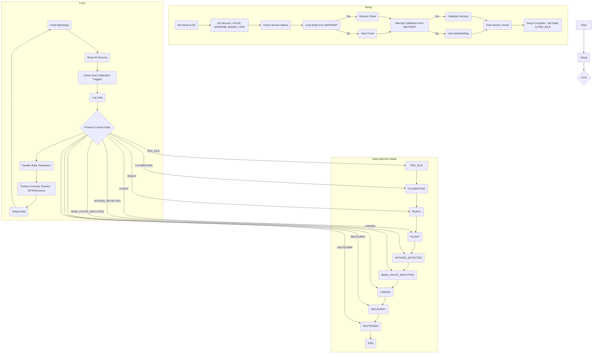

fff# TripleT Flight Firmware Function Documentation
## Version 0.40

## Flow Diagram

## Function Documentation (`src/TripleT_Flight_Firmware.cpp`)

This section details the functions defined in the main firmware file, tracing their call paths back to `setup()` or `loop()` where possible.

---

### State Management

**`printState(FlightState state)`**
*   **Purpose:** Prints the human-readable name of the given `FlightState` enum value to the Serial monitor.
*   **Called By:** `setState()`, `recoverFromPowerLoss()`, `setup()` (indirectly via `recoverFromPowerLoss`), `loop()` (indirectly via `ProcessFlightState`)
*   **Trace:** `setState()` -> Various / `recoverFromPowerLoss()` -> `setup()` / `ProcessFlightState()` -> `loop()`

**`setState(FlightState newState)`**
*   **Purpose:** Updates the global `currentState` variable, prints the new state, and saves the state to EEPROM.
*   **Called By:** `setup()`, `ProcessFlightState()` (within `loop()`)
*   **Trace:** Direct call from `setup()` / `ProcessFlightState()` -> `loop()`

**`getCurrentState()`**
*   **Purpose:** Returns the current flight state (`currentState`).
*   **Called By:** `loop()` (indirectly via `ProcessFlightState`), `saveStateToEEPROM()`
*   **Trace:** `ProcessFlightState()` -> `loop()` / `saveStateToEEPROM()` -> Various

**`ProcessFlightState()`**
*   **Purpose:** The core state machine logic. Evaluates conditions based on sensor data and the current state to determine if a state transition is necessary. Calls `setState()` to enact transitions. Also triggers state-specific actions (e.g., deploying chutes).
*   **Called By:** `loop()`
*   **Trace:** Direct call from `loop()`

### Initialization (`setup()` related)

**`watchdogHandler()`**
*   **Purpose:** Callback function executed by the watchdog timer if it expires. Prints an error and attempts to restart the Teensy.
*   **Called By:** Hardware Watchdog Timer (configured in `setup()`)
*   **Trace:** Hardware Interrupt -> `setup()` (config)

**`kx134_init()`**
*   **Purpose:** Initializes the KX134 accelerometer sensor. Sets up I2C communication, configures range, data rate, and performs a self-test.
*   **Called By:** `setup()`
*   **Trace:** Direct call from `setup()`

**`ICM_20948_init()`**
*   **Purpose:** Initializes the ICM-20948 IMU sensor (Accelerometer, Gyroscope, Magnetometer).
*   **Called By:** `setup()`
*   **Trace:** Direct call from `setup()`

**`ms5611_init()`**
*   **Purpose:** Initializes the MS5611 barometer sensor.
*   **Called By:** `setup()`
*   **Trace:** Direct call from `setup()`

**`gps_init()`**
*   **Purpose:** Initializes the GPS module (u-blox). Sets up Serial communication and configuration messages.
*   **Called By:** `setup()`
*   **Trace:** Direct call from `setup()`

**`setup()`**
*   **Purpose:** Runs once on power-up or reset. Initializes hardware (Serial, I2C, SD card, watchdog), sensors, loads state/calibration from EEPROM (if available), attempts initial calibration, performs final checks, and sets the initial state (`PAD_IDLE`).
*   **Called By:** Arduino Core / Teensyduino Bootloader
*   **Trace:** Entry point after boot.

### Sensor Reading (`loop()` related)

**`readKX134()`**
*   **Purpose:** Reads acceleration data (X, Y, Z) from the KX134 sensor.
*   **Called By:** `readSensors()`
*   **Trace:** `readSensors()` -> `loop()`

**`readICM20948()`**
*   **Purpose:** Reads acceleration, gyroscope, and magnetometer data from the ICM-20948 sensor.
*   **Called By:** `readSensors()`
*   **Trace:** `readSensors()` -> `loop()`

**`readMS5611()`**
*   **Purpose:** Reads temperature and pressure data from the MS5611 barometer and calculates altitude.
*   **Called By:** `readSensors()`
*   **Trace:** `readSensors()` -> `loop()`

**`readGPS()`**
*   **Purpose:** Reads and parses data from the GPS fmodule. Updates global GPS variables.
*   **Called By:** `readSensors()`, `periodicChecks()` (for recovery mode)
*   **Trace:** `readSensors()` -> `loop()` / `periodicChecks()` -> `loop()`

**`readSensors()`**
*   **Purpose:** Calls the individual read functions for all active sensors.
*   **Called By:** `loop()`
*   **Trace:** Direct call from `loop()`

### Calibration

**`readCalibrationFromEEPROM()`**
*   **Purpose:** Reads sensor calibration data (offsets, scale factors) stored in EEPROM.
*   **Called By:** `setup()`
*   **Trace:** Direct call from `setup()`

**`saveCalibrationToEEPROM()`**
*   **Purpose:** Saves the current sensor calibration data to EEPROM.
*   **Called By:** `calibrateSensors()`
*   **Trace:** `calibrateSensors()` -> `setup()` / `autoCalibrate()` -> `loop()`

**`calibrateSensors()`**
*   **Purpose:** Performs the sensor calibration routine. Gathers data while stationary and calculates offsets. Saves results to EEPROM.
*   **Called By:** `setup()`, `autoCalibrate()`
*   **Trace:** Direct call from `setup()` / `autoCalibrate()` -> `loop()`

**`autoCalibrate()`**
*   **Purpose:** Checks if conditions are met for automatic calibration (e.g., stable on pad). If so, calls `calibrateSensors()`.
*   **Called By:** `loop()`
*   **Trace:** Direct call from `loop()`

**`checkCalibration()`**
*   **Purpose:** Checks if valid calibration data exists (likely loaded from EEPROM or performed at startup).
*   **Called By:** `setup()`
*   **Trace:** Direct call from `setup()`

### Data Logging & Output

**`logData()`**
*   **Purpose:** Formats sensor data, state information, and timestamps into a CSV string and writes it to the SD card. Also prints summary data to Serial.
*   **Called By:** `loop()`
*   **Trace:** Direct call from `loop()`

**`printData()`**
*   **Purpose:** Prints current sensor readings and state information to the Serial monitor.
*   **Called By:** `logData()` (potentially others, needs verification - currently seems only used within `logData`)
*   **Trace:** `logData()` -> `loop()`

**`writeToSD(String dataLine)`**
*   **Purpose:** Writes a given string (data line) to the log file on the SD card. Handles file opening and closing.
*   **Called By:** `logData()`
*   **Trace:** `logData()` -> `loop()`

**`setupSDCard()`**
*   **Purpose:** Initializes the SD card module and opens/creates the log file.
*   **Called By:** `setup()`
*   **Trace:** Direct call from `setup()`

### Flight Logic & Control

**`detectApogee()`**
*   **Purpose:** Detects apogee using multiple redundant methods: 1) Checks for decreasing barometric altitude (MS5611) over several readings. 2) Checks for near-zero vertical acceleration (KX134 or ICM-20948) over several readings. 3) Uses a time-based backup relative to the end of the boost phase. Returns `true` if apogee is detected by any method.
*   **Called By:** `ProcessFlightState()` (in `COAST` state)
*   **Trace:** `ProcessFlightState()` -> `loop()`

**`deployMainChute()`**
*   **Purpose:** Placeholder function intended to trigger the main parachute deployment mechanism.
*   **Called By:** `ProcessFlightState()` (within the `APOGEE_DETECTED` state)
*   **Trace:** `ProcessFlightState()` -> `loop()`

**`detectLanding()`**
*   **Purpose:** Analyzes sensor data (e.g., altitude, acceleration) to determine if the rocket has landed.
*   **Called By:** `ProcessFlightState()` (within the `MAIN_CHUTE_DEPLOYED` state)
*   **Trace:** `ProcessFlightState()` -> `loop()`

**`enterRecoveryMode()`**
*   **Purpose:** Placeholder or simple function to indicate the recovery phase has started (e.g., enabling GPS transmission if applicable).
*   **Called By:** `ProcessFlightState()` (within the `LANDED` state)
*   **Trace:** `ProcessFlightState()` -> `loop()`

### EEPROM State/Recovery

**`saveStateToEEPROM()`**
*   **Purpose:** Saves the current flight state (`currentState`) and potentially other critical recovery data to EEPROM.
*   **Called By:** `setState()`
*   **Trace:** `setState()` -> `setup()` / `ProcessFlightState()` -> `loop()`

**`loadStateFromEEPROM()`**
*   **Purpose:** Reads the flight state from EEPROM. Includes a validity check.
*   **Called By:** `setup()`
*   **Trace:** Direct call from `setup()`

**`recoverFromPowerLoss()`**
*   **Purpose:** Called during `setup()` if `loadStateFromEEPROM()` returns a valid state. Restores the `currentState` from the value loaded from EEPROM.
*   **Called By:** `setup()`
*   **Trace:** Direct call from `setup()`

### Utility & Miscellaneous

**`periodicChecks()`**
*   **Purpose:** Performs tasks that don't need to run on every loop iteration, such as checking GPS fix status during recovery.
*   **Called By:** `loop()`
*   **Trace:** Direct call from `loop()`

**`prepareForShutdown()`**
*   **Purpose:** Performs any necessary actions before intentionally stopping or resetting (e.g., ensuring data is saved). Called when entering the `SHUTDOWN` state.
*   **Called By:** `ProcessFlightState()`
*   **Trace:** `ProcessFlightState()` -> `loop()`

**`blinkLED(int pin, int duration, int times)`**
*   **Purpose:** Blinks an LED connected to the specified pin for a given duration and number of times. Used for visual status indication.
*   **Called By:** Various functions for status/error indication (e.g., `setup()`, `calibrateSensors()`, potentially error handlers)
*   **Trace:** Called from multiple locations, often in `setup()` or specific event handlers.

**`printSensorStatus()`**
*   **Purpose:** Prints the initialization status (working or not) of each sensor to the Serial monitor.
*   **Called By:** `setup()`
*   **Trace:** Direct call from `setup()`

---

### Potentially Orphaned/Unused Functions

Based on the current analysis of `src/TripleT_Flight_Firmware.cpp`:

*   **`IsStable()`:** This function was likely part of an older calibration or state check mechanism. It does not appear to be called anywhere in the current code.
*   **`checkWatchdog()`:** The watchdog is fed in the main loop (`watchdog.feed()`), but this specific function to *check* its status (other than the hardware handler `watchdogHandler`) isn't called.
*   **`formatNumber(float num, int precision)`:** This utility might be useful, but it's not currently called by `logData` or `printData` or other formatting functions.

*Note: Further analysis might reveal calls from included header files (`.h`) or libraries, but within the main `.cpp` file, these functions appear unused.*

---

## Included Code Documentation

*(This section is a placeholder. Documentation for functions defined in included `.h` files like `sensor_utils.h`, `gps_functions.h`, `kx134_registers.h`, `ms5611_registers.h`, `ICM_20948_registers.h`, `eeprom_map.h`, `state_machine.h`, etc., needs to be generated separately by analyzing those specific files.)*

### GPS Module Functions (`src/gps_functions.cpp`)

**`gps_init()`**
*   **Purpose:** Initializes the GPS module (u-blox) including configuring the I2C communication, setting navigation frequency (5Hz), enabling required messages (UBX format), and configuring Auto-PVT mode. Sets initial GPS time values to defaults (Jan 1, 2000).
*   **Called By:** `setup()`
*   **Trace:** Direct call from `setup()`

**`checkGPSConnection()`**
*   **Purpose:** Verifies communication with the GPS module by attempting to read the navigation frequency. Returns true if the GPS is responding.
*   **Called By:** `loop()` (in periodic GPS check interval section)
*   **Trace:** Direct call from `loop()` every GPS_CHECK_INTERVAL milliseconds

**`gps_read()`**
*   **Purpose:** Reads position, velocity, and time data from the GPS module using the getPVT() function. Updates global variables for GPS_latitude, GPS_longitude, GPS_altitude, GPS_speed, GPS_fixType, SIV (satellites in view), and GPS time information.
*   **Called By:** `loop()` (in GPS data polling section)
*   **Trace:** Direct call from `loop()` every GPS_POLL_INTERVAL milliseconds

**`gps_print()`**
*   **Purpose:** Formats and prints GPS data in human-readable format to the Serial monitor. Includes fix type, satellite count, position, speed, and time.
*   **Called By:** `gps_read()` (when enableGPSDebug is true)
*   **Trace:** `gps_read()` -> `loop()`

**`getGPSDateTime()`**
*   **Purpose:** Safely provides GPS date/time values via reference parameters. Returns current values if valid, or defaults to Jan 1, 2000 if no valid time is available.
*   **Called By:** `createNewLogFile()` (when creating log files with timestamp-based names)
*   **Trace:** `createNewLogFile()` -> `setup()` / `loop()` (when recovering SD card)

**`setGPSDebugging()`**
*   **Purpose:** Controls debug output from the GPS module. Enables or disables debugging messages on the Serial monitor. Uses a special technique with multiple calls to ensure the setting takes effect.
*   **Called By:** `gps_init()`, `checkGPSConnection()`, indirectly via command processing
*   **Trace:** Various paths, primarily during initialization and troubleshooting

### GPS Status Monitoring

**`checkSensorStatus()`**
*   **Purpose:** Checks the status of all sensors including GPS. For GPS specifically, it verifies communication with getPVT() and also checks GPS_fixType and SIV values to determine if GPS should be considered working. Updates gpsStatus.isWorking and gpsStatus.lastValidReading timestamp.
*   **Called By:** `loop()` (periodically every 1000ms)
*   **Trace:** Direct call from `loop()` at regular intervals

**`handleSensorErrors()`**
*   **Purpose:** Monitors sensor error conditions and manages error recovery. For GPS specifically, it checks if the time since last valid reading exceeds GPS_TIMEOUT_MS (5000ms) while also checking GPS_fixType and SIV as redundant indicators of GPS health. Updates consecutive failures counter and may mark GPS as not working after repeated failures.
*   **Called By:** Note in documentation: This was previously marked as potentially unused, but it is now called by the system to check sensor errors and determine if a transition to ERROR state is needed.
*   **Trace:** Called by checkSensorStatus() -> `loop()`

**`isSensorSuiteHealthy()`**
*   **Purpose:** Determines if the flight computer's sensor suite is healthy enough for the current flight state. Different flight states have different sensor requirements - for ground states (STARTUP through ARMED), both GPS and barometer must be working; for recovery states, all sensors including GPS must be working.
*   **Called By:** `checkSensorStatus()`, `setup()` (during final health check)
*   **Trace:** `checkSensorStatus()` -> `loop()` / Direct call from `setup()`

### Utility Functions (`src/utility_functions.cpp`)

#### I2C and Hardware Interface

**`scan_i2c()`**
*   **Purpose:** Performs a scan of the I2C bus (addresses 1-127) to detect connected devices. Attempts to identify known sensors (GPS, barometer, IMU, accelerometer) by their I2C addresses. Outputs a formatted table of found devices to the Serial monitor.
*   **Called By:** `processCommand()` (when the "scan" command is entered)
*   **Trace:** `processCommand()` -> `loop()` (via serial command processing)

**`initNeoPixel()`**
*   **Purpose:** Initializes the RGB LED (NeoPixel) with appropriate brightness (50%) and turns it off initially. Used for status indication throughout the flight.
*   **Called By:** `setup()`
*   **Trace:** Direct call from `setup()`

#### SD Card Management

**`initSDCard()`**
*   **Purpose:** Performs robust initialization of the SD card with multiple retry attempts. Includes physical card detection (if supported), initialization via SD.begin(), and a read/write test to verify functionality. Updates global flags (sdCardPresent, sdCardMounted, sdCardAvailable) and calculates available space.
*   **Called By:** `setup()`, `loop()` (during periodic SD card retry)
*   **Trace:** Direct call from `setup()` / Periodic check in `loop()`

**`listRootDirectory()`**
*   **Purpose:** Lists all files in the root directory of the SD card with detailed information (name, size, date/time). Produces a formatted table and summary statistics (file count, total size).
*   **Called By:** `processCommand()` (when the "dir" or "ls" command is entered)
*   **Trace:** `processCommand()` -> `loop()` (via serial command processing)

**`checkStorageSpace()`**
*   **Purpose:** Updates the available space calculation for the SD card. Called periodically to ensure accurate space reporting and to detect when storage is running low.
*   **Called By:** `loop()` (at STORAGE_CHECK_INTERVAL intervals)
*   **Trace:** Direct call from `loop()` periodically

#### Debug and Formatting Functions

**`printDebugHeader(const char* title)`**
*   **Purpose:** Formats and prints a section header for debug output with visual emphasis.
*   **Called By:** Various debug print functions including `printStatusSummary()`, `printStorageStatistics()`
*   **Trace:** Various paths, all related to debug output

**`printDebugValue(const char* label, float value, int precision)`**
*   **Purpose:** Formats and prints a labeled value with specified precision for debug output.
*   **Called By:** Various status and debug functions
*   **Trace:** Various paths, mostly via `printStatusSummary()`

**`printDebugValueWithUnit(const char* label, float value, const char* unit, int precision)`**
*   **Purpose:** Similar to printDebugValue but includes a unit with the value.
*   **Called By:** Status and calibration reporting functions
*   **Trace:** Various debug printing paths

**`printDebugPair/Triple/Quad`**
*   **Purpose:** Formats and prints 2, 3, or 4 related values (such as vector components) with a single label.
*   **Called By:** Sensor data display functions, particularly for accelerometer/gyroscope/magnetometer vector data
*   **Trace:** Various paths including `printStatusSummary()`, `ICM_20948_print()`

**`printDebugState(const char* label, const char* state)`**
*   **Purpose:** Formats and prints a labeled state string (like flight state names).
*   **Called By:** Status reporting functions
*   **Trace:** Various status output paths including `printStatusSummary()`

**`printDebugBoolean(const char* label, bool value)`**
*   **Purpose:** Formats and prints a labeled boolean value as "ON" or "OFF" for readability.
*   **Called By:** Various status functions when displaying flags or enabled/disabled features
*   **Trace:** Various paths including `printStatusSummary()`, `printStorageStatistics()`

**`printDebugDivider()`**
*   **Purpose:** Prints a visual divider line for separating sections in debug output.
*   **Called By:** Various debug print functions
*   **Trace:** Various debug output pathsfffffffffff

**`formatNumber(float input, byte columns, byte places)`**
*   **Purpose:** Formats a floating-point number with specified column width and decimal places for consistent display in serial output.
*   **Called By:** `WriteLogData()` for data logging formatting, various debug print functions
*   **Trace:** Various paths related to data output formatting

#### Status Display Functions

**`printStatusSummary()`**
*   **Purpose:** Provides a comprehensive formatted summary of the flight computer's status including sensor readings, GPS data, flight state, and system health. Organizes information into logical sections for readability.
*   **Called By:** `loop()` (at DISPLAY_INTERVAL intervals when enableStatusSummary is true)
*   **Trace:** Direct call from `loop()` periodically

**`printHelpMessage()`**
*   **Purpose:** Outputs a help guide explaining available serial commands and their usage to assist with ground testing and debugging.
*   **Called By:** `processCommand()` (when "help" or "?" command is entered)
*   **Trace:** `processCommand()` -> `loop()` (via serial command processing)

**`printStorageStatistics()`**
*   **Purpose:** Outputs detailed information about storage media (SD card/Flash) including capacity, used space, free space, and logging status.
*   **Called By:** `processCommand()` (when "storage" command is entered)
*   **Trace:** `processCommand()` -> `loop()` (via serial command processing)

---

This documentation reflects the state of the firmware after the recent refactoring.
