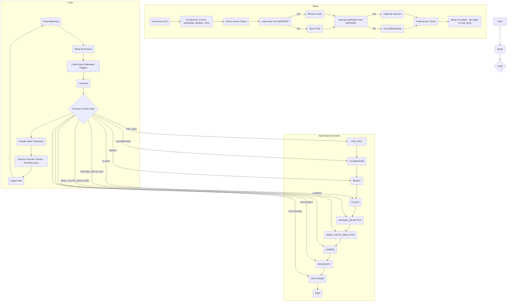

# TripleT Flight Firmware Function Documentation

## Flow Diagram

## Function Documentation (`src/TripleT_Flight_Firmware.cpp`)

This section details the functions defined in the main firmware file, tracing their call paths back to `setup()` or `loop()` where possible.

---

### State Management

**`printState(FlightState state)`**
*   **Purpose:** Prints the human-readable name of the given `FlightState` enum value to the Serial monitor.
*   **Called By:** `setState()`, `recoverFromPowerLoss()`, `setup()` (indirectly via `recoverFromPowerLoss`), `loop()` (indirectly via `ProcessFlightState`)
*   **Trace:** `setState()` -> Various / `recoverFromPowerLoss()` -> `setup()` / `ProcessFlightState()` -> `loop()`

**`setState(FlightState newState)`**
*   **Purpose:** Updates the global `currentState` variable, prints the new state, and saves the state to EEPROM.
*   **Called By:** `setup()`, `ProcessFlightState()` (within `loop()`)
*   **Trace:** Direct call from `setup()` / `ProcessFlightState()` -> `loop()`

**`getCurrentState()`**
*   **Purpose:** Returns the current flight state (`currentState`).
*   **Called By:** `loop()` (indirectly via `ProcessFlightState`), `saveStateToEEPROM()`
*   **Trace:** `ProcessFlightState()` -> `loop()` / `saveStateToEEPROM()` -> Various

**`ProcessFlightState()`**
*   **Purpose:** The core state machine logic. Evaluates conditions based on sensor data and the current state to determine if a state transition is necessary. Calls `setState()` to enact transitions. Also triggers state-specific actions (e.g., deploying chutes).
*   **Called By:** `loop()`
*   **Trace:** Direct call from `loop()`

### Initialization (`setup()` related)

**`watchdogHandler()`**
*   **Purpose:** Callback function executed by the watchdog timer if it expires. Prints an error and attempts to restart the Teensy.
*   **Called By:** Hardware Watchdog Timer (configured in `setup()`)
*   **Trace:** Hardware Interrupt -> `setup()` (config)

**`kx134_init()`**
*   **Purpose:** Initializes the KX134 accelerometer sensor. Sets up I2C communication, configures range, data rate, and performs a self-test.
*   **Called By:** `setup()`
*   **Trace:** Direct call from `setup()`

**`ICM_20948_init()`**
*   **Purpose:** Initializes the ICM-20948 IMU sensor (Accelerometer, Gyroscope, Magnetometer).
*   **Called By:** `setup()`
*   **Trace:** Direct call from `setup()`

**`ms5611_init()`**
*   **Purpose:** Initializes the MS5611 barometer sensor.
*   **Called By:** `setup()`
*   **Trace:** Direct call from `setup()`

**`gps_init()`**
*   **Purpose:** Initializes the GPS module (u-blox). Sets up Serial communication and configuration messages.
*   **Called By:** `setup()`
*   **Trace:** Direct call from `setup()`

**`setup()`**
*   **Purpose:** Runs once on power-up or reset. Initializes hardware (Serial, I2C, SD card, watchdog), sensors, loads state/calibration from EEPROM (if available), attempts initial calibration, performs final checks, and sets the initial state (`PAD_IDLE`).
*   **Called By:** Arduino Core / Teensyduino Bootloader
*   **Trace:** Entry point after boot.

### Sensor Reading (`loop()` related)

**`readKX134()`**
*   **Purpose:** Reads acceleration data (X, Y, Z) from the KX134 sensor.
*   **Called By:** `readSensors()`
*   **Trace:** `readSensors()` -> `loop()`

**`readICM20948()`**
*   **Purpose:** Reads acceleration, gyroscope, and magnetometer data from the ICM-20948 sensor.
*   **Called By:** `readSensors()`
*   **Trace:** `readSensors()` -> `loop()`

**`readMS5611()`**
*   **Purpose:** Reads temperature and pressure data from the MS5611 barometer and calculates altitude.
*   **Called By:** `readSensors()`
*   **Trace:** `readSensors()` -> `loop()`

**`readGPS()`**
*   **Purpose:** Reads and parses data from the GPS module. Updates global GPS variables.
*   **Called By:** `readSensors()`, `periodicChecks()` (for recovery mode)
*   **Trace:** `readSensors()` -> `loop()` / `periodicChecks()` -> `loop()`

**`readSensors()`**
*   **Purpose:** Calls the individual read functions for all active sensors.
*   **Called By:** `loop()`
*   **Trace:** Direct call from `loop()`

### Calibration

**`readCalibrationFromEEPROM()`**
*   **Purpose:** Reads sensor calibration data (offsets, scale factors) stored in EEPROM.
*   **Called By:** `setup()`
*   **Trace:** Direct call from `setup()`

**`saveCalibrationToEEPROM()`**
*   **Purpose:** Saves the current sensor calibration data to EEPROM.
*   **Called By:** `calibrateSensors()`
*   **Trace:** `calibrateSensors()` -> `setup()` / `autoCalibrate()` -> `loop()`

**`calibrateSensors()`**
*   **Purpose:** Performs the sensor calibration routine. Gathers data while stationary and calculates offsets. Saves results to EEPROM.
*   **Called By:** `setup()`, `autoCalibrate()`
*   **Trace:** Direct call from `setup()` / `autoCalibrate()` -> `loop()`

**`autoCalibrate()`**
*   **Purpose:** Checks if conditions are met for automatic calibration (e.g., stable on pad). If so, calls `calibrateSensors()`.
*   **Called By:** `loop()`
*   **Trace:** Direct call from `loop()`

**`checkCalibration()`**
*   **Purpose:** Checks if valid calibration data exists (likely loaded from EEPROM or performed at startup).
*   **Called By:** `setup()`
*   **Trace:** Direct call from `setup()`

### Data Logging & Output

**`logData()`**
*   **Purpose:** Formats sensor data, state information, and timestamps into a CSV string and writes it to the SD card. Also prints summary data to Serial.
*   **Called By:** `loop()`
*   **Trace:** Direct call from `loop()`

**`printData()`**
*   **Purpose:** Prints current sensor readings and state information to the Serial monitor.
*   **Called By:** `logData()` (potentially others, needs verification - currently seems only used within `logData`)
*   **Trace:** `logData()` -> `loop()`

**`writeToSD(String dataLine)`**
*   **Purpose:** Writes a given string (data line) to the log file on the SD card. Handles file opening and closing.
*   **Called By:** `logData()`
*   **Trace:** `logData()` -> `loop()`

**`setupSDCard()`**
*   **Purpose:** Initializes the SD card module and opens/creates the log file.
*   **Called By:** `setup()`
*   **Trace:** Direct call from `setup()`

### Flight Logic & Control

**`detectApogee()`**
*   **Purpose:** Analyzes altitude data (likely from the barometer) to detect when the rocket has reached its highest point (apogee).
*   **Called By:** `ProcessFlightState()` (within the `FLIGHT` state)
*   **Trace:** `ProcessFlightState()` -> `loop()`

**`deployMainChute()`**
*   **Purpose:** Placeholder function intended to trigger the main parachute deployment mechanism.
*   **Called By:** `ProcessFlightState()` (within the `APOGEE_DETECTED` state)
*   **Trace:** `ProcessFlightState()` -> `loop()`

**`detectLanding()`**
*   **Purpose:** Analyzes sensor data (e.g., altitude, acceleration) to determine if the rocket has landed.
*   **Called By:** `ProcessFlightState()` (within the `MAIN_CHUTE_DEPLOYED` state)
*   **Trace:** `ProcessFlightState()` -> `loop()`

**`enterRecoveryMode()`**
*   **Purpose:** Placeholder or simple function to indicate the recovery phase has started (e.g., enabling GPS transmission if applicable).
*   **Called By:** `ProcessFlightState()` (within the `LANDED` state)
*   **Trace:** `ProcessFlightState()` -> `loop()`

### EEPROM State/Recovery

**`saveStateToEEPROM()`**
*   **Purpose:** Saves the current flight state (`currentState`) and potentially other critical recovery data to EEPROM.
*   **Called By:** `setState()`
*   **Trace:** `setState()` -> `setup()` / `ProcessFlightState()` -> `loop()`

**`loadStateFromEEPROM()`**
*   **Purpose:** Reads the flight state from EEPROM. Includes a validity check.
*   **Called By:** `setup()`
*   **Trace:** Direct call from `setup()`

**`recoverFromPowerLoss()`**
*   **Purpose:** Called during `setup()` if `loadStateFromEEPROM()` returns a valid state. Restores the `currentState` from the value loaded from EEPROM.
*   **Called By:** `setup()`
*   **Trace:** Direct call from `setup()`

### Utility & Miscellaneous

**`periodicChecks()`**
*   **Purpose:** Performs tasks that don't need to run on every loop iteration, such as checking GPS fix status during recovery.
*   **Called By:** `loop()`
*   **Trace:** Direct call from `loop()`

**`prepareForShutdown()`**
*   **Purpose:** Performs any necessary actions before intentionally stopping or resetting (e.g., ensuring data is saved). Called when entering the `SHUTDOWN` state.
*   **Called By:** `ProcessFlightState()`
*   **Trace:** `ProcessFlightState()` -> `loop()`

**`blinkLED(int pin, int duration, int times)`**
*   **Purpose:** Blinks an LED connected to the specified pin for a given duration and number of times. Used for visual status indication.
*   **Called By:** Various functions for status/error indication (e.g., `setup()`, `calibrateSensors()`, potentially error handlers)
*   **Trace:** Called from multiple locations, often in `setup()` or specific event handlers.

**`printSensorStatus()`**
*   **Purpose:** Prints the initialization status (working or not) of each sensor to the Serial monitor.
*   **Called By:** `setup()`
*   **Trace:** Direct call from `setup()`

---

### Potentially Orphaned/Unused Functions

Based on the current analysis of `src/TripleT_Flight_Firmware.cpp`:

*   **`IsStable()`:** This function was likely part of an older calibration or state check mechanism. It does not appear to be called anywhere in the current code.
*   **`handleSensorErrors()`:** While sensor errors are checked (e.g., during init), this specific centralized handler function doesn't seem to be called. Error handling appears integrated into the initialization and read functions.
*   **`checkWatchdog()`:** The watchdog is fed in the main loop (`watchdog.feed()`), but this specific function to *check* its status (other than the hardware handler `watchdogHandler`) isn't called.
*   **`formatNumber(float num, int precision)`:** This utility might be useful, but it's not currently called by `logData` or `printData` or other formatting functions.

*Note: Further analysis might reveal calls from included header files (`.h`) or libraries, but within the main `.cpp` file, these functions appear unused.*

---

## Included Code Documentation

*(This section is a placeholder. Documentation for functions defined in included `.h` files like `sensor_utils.h`, `gps_functions.h`, `kx134_registers.h`, `ms5611_registers.h`, `ICM_20948_registers.h`, `eeprom_map.h`, `state_machine.h`, etc., needs to be generated separately by analyzing those specific files.)*

---

This documentation reflects the state of the firmware after the recent refactoring. 