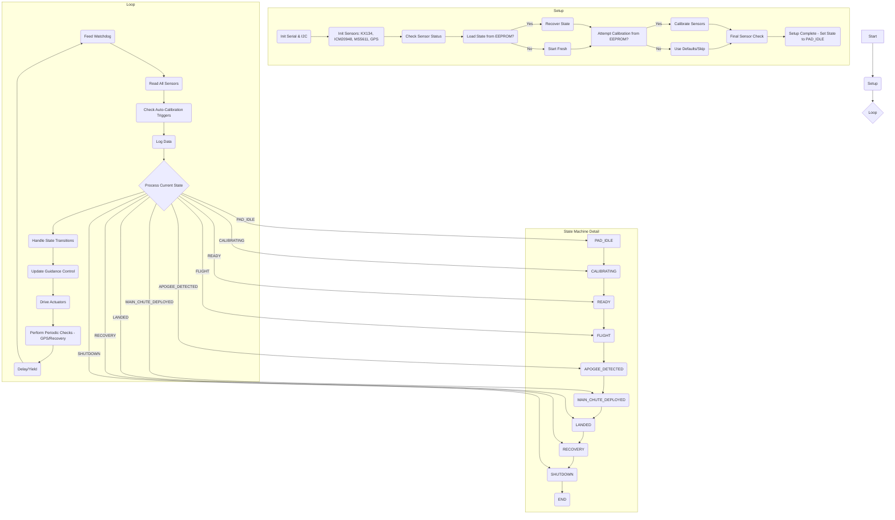

# TripleT Flight Firmware Function Documentation
## Version 0.30

## Flow Diagram

## Function Documentation (`src/TripleT_Flight_Firmware.cpp`)

This section details the functions defined in the main firmware file, tracing their call paths back to `setup()` or `loop()` where possible.

---

### State Management

**`printState(FlightState state)`**
*   **Purpose:** Prints the human-readable name of the given `FlightState` enum value to the Serial monitor.
*   **Called By:** `setState()`, `recoverFromPowerLoss()`, `setup()` (indirectly via `recoverFromPowerLoss`), `loop()` (indirectly via `ProcessFlightState`)
*   **Trace:** `setState()` -> Various / `recoverFromPowerLoss()` -> `setup()` / `ProcessFlightState()` -> `loop()`

**`setState(FlightState newState)`**
*   **Purpose:** Updates the global `currentState` variable, prints the new state, and saves the state to EEPROM.
*   **Called By:** `setup()`, `ProcessFlightState()` (within `loop()`)
*   **Trace:** Direct call from `setup()` / `ProcessFlightState()` -> `loop()`

**`getCurrentState()`**
*   **Purpose:** Returns the current flight state (`currentState`).
*   **Called By:** `loop()` (indirectly via `ProcessFlightState`), `saveStateToEEPROM()`
*   **Trace:** `ProcessFlightState()` -> `loop()` / `saveStateToEEPROM()` -> Various

**`ProcessFlightState()`**
*   **Purpose:** The core state machine logic. Evaluates conditions based on sensor data and the current state to determine if a state transition is necessary. Calls `setState()` to enact transitions. Also triggers state-specific actions (e.g., deploying chutes).
*   **Called By:** `loop()`
*   **Trace:** Direct call from `loop()`

### Initialization (`setup()` related)

**`watchdogHandler()`**
*   **Purpose:** Callback function executed by the watchdog timer if it expires. Prints an error and attempts to restart the Teensy.
*   **Called By:** Hardware Watchdog Timer (configured in `setup()`)
*   **Trace:** Hardware Interrupt -> `setup()` (config)

**`kx134_init()`**
*   **Purpose:** Initializes the KX134 accelerometer sensor. Sets up I2C communication, configures range, data rate, and performs a self-test.
*   **Called By:** `setup()`
*   **Trace:** Direct call from `setup()`

**`ICM_20948_init()`**
*   **Purpose:** Initializes the ICM-20948 IMU sensor (Accelerometer, Gyroscope, Magnetometer).
*   **Called By:** `setup()`
*   **Trace:** Direct call from `setup()`

**`ms5611_init()`**
*   **Purpose:** Initializes the MS5611 barometer sensor.
*   **Called By:** `setup()`
*   **Trace:** Direct call from `setup()`

**`gps_init()`**
*   **Purpose:** Initializes the GPS module (u-blox). Sets up Serial communication and configuration messages.
*   **Called By:** `setup()`
*   **Trace:** Direct call from `setup()`

**`setup()`**
*   **Purpose:** Runs once on power-up or reset. Initializes hardware (Serial, I2C, SD card, watchdog), sensors, loads state/calibration from EEPROM (if available), attempts initial calibration, performs final checks, and sets the initial state (`PAD_IDLE`).
*   **Called By:** Arduino Core / Teensyduino Bootloader
*   **Trace:** Entry point after boot.

### Sensor Reading (`loop()` related)

**`readKX134()`**
*   **Purpose:** Reads acceleration data (X, Y, Z) from the KX134 sensor.
*   **Called By:** `readSensors()`, `loop()` (at specific intervals)
*   **Trace:** `readSensors()` -> `loop()` / Direct interval-based call in `loop()`

**`readICM20948()`**
*   **Purpose:** Reads acceleration, gyroscope, and magnetometer data from the ICM-20948 sensor.
*   **Called By:** `readSensors()`, `loop()` (at specific intervals)
*   **Trace:** `readSensors()` -> `loop()` / Direct interval-based call in `loop()`

**`readMS5611()`**
*   **Purpose:** Reads temperature and pressure data from the MS5611 barometer and calculates altitude.
*   **Called By:** `readSensors()`, `loop()` (at specific intervals)
*   **Trace:** `readSensors()` -> `loop()` / Direct interval-based call in `loop()`

**`readGPS()`**
*   **Purpose:** Reads and parses data from the GPS module. Updates global GPS variables.
*   **Called By:** `readSensors()`, `periodicChecks()` (for recovery mode), `loop()` (at specific intervals)
*   **Trace:** `readSensors()` -> `loop()` / `periodicChecks()` -> `loop()` / Direct interval-based call in `loop()`

**`readSensors()`**
*   **Purpose:** Calls the individual read functions for all active sensors.
*   **Called By:** `loop()`
*   **Trace:** Direct call from `loop()`

### Calibration

**`readCalibrationFromEEPROM()`**
*   **Purpose:** Reads sensor calibration data (offsets, scale factors) stored in EEPROM.
*   **Called By:** `setup()`
*   **Trace:** Direct call from `setup()`

**`saveCalibrationToEEPROM()`**
*   **Purpose:** Saves the current sensor calibration data to EEPROM.
*   **Called By:** `calibrateSensors()`, `performCalibration()`
*   **Trace:** `calibrateSensors()` -> `setup()` / `performCalibration()` -> `processCommand()` -> `loop()`

**`calibrateSensors()`**
*   **Purpose:** Performs the sensor calibration routine. Gathers data while stationary and calculates offsets. Saves results to EEPROM.
*   **Called By:** `setup()`, `performCalibration()`
*   **Trace:** Direct call from `setup()` / `performCalibration()` -> `processCommand()` -> `loop()`

**`performCalibration()`**
*   **Purpose:** Command-triggered function that initiates barometer calibration after verifying sensor readiness.
*   **Called By:** `processCommand()` (when 'calibrate' or 'h' command is received)
*   **Trace:** `processCommand()` -> `loop()`

**`ms5611_calibrate_with_gps()`**
*   **Purpose:** Calibrates the barometer using GPS altitude data. Sets the altitude offset based on the difference between barometric and GPS altitude readings.
*   **Called By:** `loop()` (during automatic calibration), `performCalibration()`
*   **Trace:** Direct conditional call in `loop()` / `performCalibration()` -> `processCommand()` -> `loop()`

**`checkCalibration()`**
*   **Purpose:** Checks if valid calibration data exists (likely loaded from EEPROM or performed at startup).
*   **Called By:** `setup()`
*   **Trace:** Direct call from `setup()`

### Data Logging & Output

**`WriteLogData(bool forceLog)`**
*   **Purpose:** Populates a LogData struct with current sensor readings, writes it to the SD card log file, and optionally outputs to Serial in CSV format. Manages log file creation and maintenance.
*   **Called By:** `loop()` (after sensor updates)
*   **Trace:** Direct call from `loop()`

**`createNewLogFile()`**
*   **Purpose:** Creates a new log file with a timestamp-based name, writes the CSV header, and prepares it for data logging.
*   **Called By:** `WriteLogData()`, `setup()`
*   **Trace:** `WriteLogData()` -> `loop()` / Direct call from `setup()`

**`closeAllFiles()`**
*   **Purpose:** Safely closes all open files, ensuring data is flushed to storage.
*   **Called By:** `prepareForShutdown()`, potentially `setup()` (recovery)
*   **Trace:** `prepareForShutdown()` -> `processCommand()` -> `loop()`

**`logDataToString(LogData logEntry)`**
*   **Purpose:** Converts a LogData struct to a CSV-formatted string for logging or serial output.
*   **Called By:** `WriteLogData()`
*   **Trace:** `WriteLogData()` -> `loop()`

**`printStatusSummary()`**
*   **Purpose:** Prints a comprehensive status summary to Serial including sensor readings, GPS data, flight state, and system health.
*   **Called By:** `loop()` (at specific intervals when enabled)
*   **Trace:** Direct interval-based call in `loop()`

**`printData()`**
*   **Purpose:** Prints current sensor readings and state information to the Serial monitor.
*   **Called By:** Various debug functions, `printStatusSummary()`
*   **Trace:** Various paths -> `loop()`

**`printStorageStatistics()`**
*   **Purpose:** Prints detailed information about storage media (SD card) including capacity, used space, and free space.
*   **Called By:** `processCommand()` (when 'storage' or 'f' command is entered)
*   **Trace:** `processCommand()` -> `loop()`

**`printSystemStatus()`**
*   **Purpose:** Prints a summary of the system status including sensor connectivity, calibration status, and system mode.
*   **Called By:** `processCommand()` (when 'status' or 'b' command is entered)
*   **Trace:** `processCommand()` -> `loop()`

**`printHelpMessage()`**
*   **Purpose:** Prints a comprehensive help message showing available commands and their descriptions.
*   **Called By:** `processCommand()` (when 'help' or 'a' command is entered)
*   **Trace:** `processCommand()` -> `loop()`

### Flight Logic & Control

**`detectApogee()`**
*   **Purpose:** Detects apogee using multiple redundant methods: 1) Checks for decreasing barometric altitude over several readings, 2) Checks for near-zero vertical acceleration, 3) Uses a time-based backup relative to the end of the boost phase.
*   **Called By:** `ProcessFlightState()` (in `FLIGHT` state)
*   **Trace:** `ProcessFlightState()` -> `loop()`

**`deployMainChute()`**
*   **Purpose:** Triggers the main parachute deployment mechanism when called during descent.
*   **Called By:** `ProcessFlightState()` (within the `APOGEE_DETECTED` state)
*   **Trace:** `ProcessFlightState()` -> `loop()`

**`detectLanding()`**
*   **Purpose:** Analyzes sensor data (acceleration stability and altitude stability) to determine if the rocket has landed.
*   **Called By:** `ProcessFlightState()` (within the `MAIN_CHUTE_DEPLOYED` state)
*   **Trace:** `ProcessFlightState()` -> `loop()`

**`detectBoostEnd()`**
*   **Purpose:** Detects the end of the boost phase by monitoring acceleration. Records the timestamp for later use in time-based apogee detection.
*   **Called By:** `ProcessFlightState()` (within the `FLIGHT` state)
*   **Trace:** `ProcessFlightState()` -> `loop()`

**`enterRecoveryMode()`**
*   **Purpose:** Initiates recovery phase operations such as enabling GPS transmission and recovery beacons.
*   **Called By:** `ProcessFlightState()` (within the `LANDED` state)
*   **Trace:** `ProcessFlightState()` -> `loop()`

**`IsStable()`**
*   **Purpose:** Determines if the rocket is stable (not experiencing significant acceleration beyond gravity) by analyzing the accelerometer data.
*   **Called By:** Calibration functions, `detectLanding()`
*   **Trace:** Various paths to calibration or landing detection

### Guidance and Control System

**`guidance_init()`**
*   **Purpose:** Initializes the guidance system, resets PID controller states, and prepares for attitude control.
*   **Called By:** `setup()`
*   **Trace:** Direct call from `setup()`

**`guidance_update()`**
*   **Purpose:** Updates the PID controllers with current orientation and rates, calculates new actuator commands based on the error from the target orientation.
*   **Called By:** `loop()` (at specific intervals)
*   **Trace:** Direct interval-based call in `loop()`

**`guidance_set_target_orientation_euler()`**
*   **Purpose:** Sets the target orientation (roll, pitch, yaw) for the guidance system in radians.
*   **Called By:** `update_guidance_targets()`, `processCommand()` (for testing)
*   **Trace:** `update_guidance_targets()` -> `loop()`

**`guidance_get_actuator_outputs()`**
*   **Purpose:** Retrieves the calculated actuator outputs (normalized values for servos).
*   **Called By:** `loop()` (during guidance update), `WriteLogData()`
*   **Trace:** Direct call in guidance section of `loop()` / `WriteLogData()` -> `loop()`

**`update_guidance_targets()`**
*   **Purpose:** Updates the guidance system's target orientation based on flight state and mission requirements.
*   **Called By:** `loop()`
*   **Trace:** Direct call from `loop()`

**`guidance_get_target_euler_angles()`**
*   **Purpose:** Retrieves the current target orientation angles for logging or display.
*   **Called By:** `WriteLogData()` (for data logging)
*   **Trace:** `WriteLogData()` -> `loop()`

**`guidance_get_pid_integrals()`**
*   **Purpose:** Retrieves the current PID integral terms for logging or debug purposes.
*   **Called By:** `WriteLogData()` (for data logging)
*   **Trace:** `WriteLogData()` -> `loop()`

**`calculate_pid_output()`** (static helper function)
*   **Purpose:** Helper function that calculates a single-axis PID output based on current value, target value, and PID parameters.
*   **Called By:** `guidance_update()`
*   **Trace:** `guidance_update()` -> `loop()`

### Unscented Kalman Filter (UKF) Functions

**`UKF::initialize()`**
*   **Purpose:** Initializes the UKF with starting values for position, velocity, and acceleration.
*   **Called By:** `setup()`, `ProcessUKF()` (first call)
*   **Trace:** Direct call from `setup()` or first `ProcessUKF()` -> `loop()`

**`UKF::generateSigmaPoints()`**
*   **Purpose:** Generates sigma points around the current state estimate for UKF prediction.
*   **Called By:** `UKF::predictMeanAndCovariance()`
*   **Trace:** `UKF::predictMeanAndCovariance()` -> `UKF::processAccel()` -> `ProcessUKF()` -> `loop()`

**`UKF::predictMeanAndCovariance()`**
*   **Purpose:** Predicts the next state and covariance based on the system model and current state.
*   **Called By:** `UKF::processAccel()`
*   **Trace:** `UKF::processAccel()` -> `ProcessUKF()` -> `loop()`

**`UKF::updateState()`**
*   **Purpose:** Updates the state estimate using the Kalman filter algorithm based on new sensor measurements.
*   **Called By:** `UKF::processAccel()`
*   **Trace:** `UKF::processAccel()` -> `ProcessUKF()` -> `loop()`

**`UKF::processAccel()`**
*   **Purpose:** Processes accelerometer data through the UKF to estimate position, velocity, and acceleration.
*   **Called By:** `ProcessUKF()`
*   **Trace:** `ProcessUKF()` -> `loop()`

**`ProcessUKF()`**
*   **Purpose:** Main function that coordinates UKF processing, handles initialization, and processes accelerometer data from both sensors.
*   **Called By:** `loop()` (at specific intervals)
*   **Trace:** Direct interval-based call in `loop()`

### EEPROM State/Recovery

**`saveStateToEEPROM()`**
*   **Purpose:** Saves the current flight state (`currentState`) and potentially other critical recovery data to EEPROM.
*   **Called By:** `setState()`, `detectLanding()`
*   **Trace:** `setState()` -> Various paths / `detectLanding()` -> `ProcessFlightState()` -> `loop()`

**`loadStateFromEEPROM()`**
*   **Purpose:** Reads the flight state from EEPROM. Includes a validity check.
*   **Called By:** `setup()`
*   **Trace:** Direct call from `setup()`

**`recoverFromPowerLoss()`**
*   **Purpose:** Called during `setup()` if `loadStateFromEEPROM()` returns a valid state. Restores the `currentState` from the value loaded from EEPROM.
*   **Called By:** `setup()`
*   **Trace:** Direct call from `setup()`

### Utility & Miscellaneous

**`checkStorageSpace()`**
*   **Purpose:** Checks available space on the SD card and warns if it's running low.
*   **Called By:** `loop()` (at specific intervals)
*   **Trace:** Direct interval-based call in `loop()`

**`checkGPSConnection()`**
*   **Purpose:** Verifies communication with the GPS module and updates connection status.
*   **Called By:** `loop()` (at specific intervals)
*   **Trace:** Direct interval-based call in `loop()`

**`prepareForShutdown()`**
*   **Purpose:** Performs necessary actions before intentional shutdown including closing files, setting LED indicators, and final beep.
*   **Called By:** `processCommand()` (when '9' command is entered)
*   **Trace:** `processCommand()` -> `loop()`

**`toggleDebugFlag()`**
*   **Purpose:** Toggles or sets a debug flag and prints its new state to the specified output stream.
*   **Called By:** `processCommand()` (for various debug commands)
*   **Trace:** `processCommand()` -> `loop()`

**`processCommand()`**
*   **Purpose:** Processes commands received via Serial interface. Supports both single-character and multi-character commands for controlling the flight computer.
*   **Called By:** `loop()` (when Serial data is available)
*   **Key Commands:**
    * **0-6:** Toggle specific debug flags
    * **9:** Initiate shutdown sequence
    * **a/help:** Show help message
    * **b/status:** Show system status
    * **c:** Dump all data (Flash - Not Implemented)
    * **d:** Erase all stored data (Flash - Not Implemented)
    * **e:** List available log files (Flash - Not Implemented)
    * **f:** Show SD card statistics
    * **g:** Toggle detailed display mode
    * **h/calibrate:** Calibrate barometer
    * **i:** Display current IMU data
    * **j/summary:** Toggle status summary display
    * **debug_<flag_name> [on|off]:** Set or toggle debug flags
    * **debug_all_off:** Disable all common debug flags
*   **Trace:** Direct conditional call in `loop()`

**`map_float()`**
*   **Purpose:** Maps a float value from one range to another, similar to Arduino's map() but for floating-point values.
*   **Called By:** `loop()` (during guidance control updates)
*   **Trace:** Direct call in guidance section of `loop()`

**`blinkLED()`**
*   **Purpose:** Blinks an LED connected to the specified pin for visual status indication.
*   **Called By:** Various functions for status/error indication
*   **Trace:** Multiple call sites throughout the firmware

**`formatNumber()`**
*   **Purpose:** Formats a floating-point number with specified column width and decimal places for display.
*   **Called By:** Various print functions including `printData()`, `printStatusSummary()`
*   **Trace:** Various paths to output formatting

**`initNeoPixel()`**
*   **Purpose:** Initializes the RGB LED (NeoPixel) for status indication.
*   **Called By:** `setup()`
*   **Trace:** Direct call from `setup()`

**`scan_i2c()`**
*   **Purpose:** Scans the I2C bus for connected devices and prints their addresses.
*   **Called By:** `processCommand()` (when 'scan' command is entered)
*   **Trace:** `processCommand()` -> `loop()`

**`initSDCard()`**
*   **Purpose:** Initializes the SD card with retry logic and verifies functionality.
*   **Called By:** `setup()`, `loop()` (during recovery attempts)
*   **Trace:** Direct call from `setup()` / Conditional recovery in `loop()`

**`listRootDirectory()`**
*   **Purpose:** Lists all files in the root directory of the SD card with detailed information.
*   **Called By:** `processCommand()` (when 'dir' or 'ls' command is entered)
*   **Trace:** `processCommand()` -> `loop()`

---

## Sensor-Specific Functions

### ICM-20948 Functions (`src/icm_20948_functions.cpp`)

**`ICM_20948_init()`**
*   **Purpose:** Initializes the ICM-20948 IMU sensor with appropriate configuration.
*   **Called By:** `setup()`
*   **Trace:** Direct call from `setup()`

**`ICM_20948_read()`**
*   **Purpose:** Reads all sensor data from the ICM-20948 (accelerometer, gyroscope, magnetometer) and updates global variables.
*   **Called By:** `loop()` (at specific intervals)
*   **Trace:** Direct interval-based call in `loop()`

**`ICM_20948_print()`**
*   **Purpose:** Prints formatted ICM-20948 sensor data to Serial for debugging.
*   **Called By:** `loop()` (when displayMode is enabled)
*   **Trace:** Conditional call in `loop()`

**`ICM_20948_get_calibrated_gyro()`**
*   **Purpose:** Returns calibrated gyroscope readings with bias correction applied.
*   **Called By:** `loop()` (during guidance updates)
*   **Trace:** Direct call in guidance section of `loop()`

**`convertQuaternionToEuler()`**
*   **Purpose:** Converts a quaternion orientation to Euler angles (roll, pitch, yaw).
*   **Called By:** `loop()` (during guidance updates), `WriteLogData()`
*   **Trace:** Multiple call sites for orientation processing

### MS5611 Functions (`src/ms5611_functions.cpp`)

**`ms5611_init()`**
*   **Purpose:** Initializes the MS5611 barometer sensor.
*   **Called By:** `setup()`
*   **Trace:** Direct call from `setup()`

**`ms5611_read()`**
*   **Purpose:** Reads temperature and pressure data from the MS5611 and updates global variables.
*   **Called By:** `loop()` (at specific intervals)
*   **Trace:** Direct interval-based call in `loop()`

**`ms5611_get_altitude()`**
*   **Purpose:** Calculates altitude based on current pressure reading and calibration.
*   **Called By:** `detectApogee()`, `detectLanding()`, various other altitude-dependent functions
*   **Trace:** Multiple call sites for altitude-based processing

**`ms5611_calibrate_with_gps()`**
*   **Purpose:** Calibrates the barometer using GPS altitude for reference.
*   **Called By:** `loop()` (during automatic calibration), `performCalibration()`
*   **Trace:** Conditional path in `loop()` / `performCalibration()` -> `processCommand()` -> `loop()`

### KX134 Functions (`src/kx134_functions.cpp`)

**`kx134_init()`**
*   **Purpose:** Initializes the KX134 accelerometer with appropriate configuration.
*   **Called By:** `setup()`
*   **Trace:** Direct call from `setup()`

**`kx134_read()`**
*   **Purpose:** Reads acceleration data from the KX134 and updates global variables.
*   **Called By:** `loop()` (at specific intervals)
*   **Trace:** Direct interval-based call in `loop()`

**`kx134_print()`**
*   **Purpose:** Prints formatted KX134 acceleration data to Serial for debugging.
*   **Called By:** Debug functions when KX134 data is requested
*   **Trace:** Various debug output paths

## Command Processing Functions

**`processCommand(String command)`**
*   **Purpose:** Processes commands received via Serial interface. Supports both single-character and multi-character commands for controlling the flight computer.
*   **Called By:** `loop()` (when Serial data is available)
*   **Key Commands:**
    * **0-6:** Toggle specific debug flags
    * **9:** Initiate shutdown sequence
    * **a/help:** Show help message
    * **b/status:** Show system status
    * **c:** Dump all data (Flash - Not Implemented)
    * **d:** Erase all stored data (Flash - Not Implemented)
    * **e:** List available log files (Flash - Not Implemented)
    * **f:** Show SD card statistics
    * **g:** Toggle detailed display mode
    * **h/calibrate:** Calibrate barometer
    * **i:** Display current IMU data
    * **j/summary:** Toggle status summary display
    * **debug_<flag_name> [on|off]:** Set or toggle debug flags
    * **debug_all_off:** Disable all common debug flags
*   **Trace:** Direct conditional call in `loop()`

## Known Limitations and Future Improvements

The following features are marked as "Not Implemented" or may need further development:

1. **Flash Storage:** Commands 'c' (dump data), 'd' (erase data), and 'e' (list log files) are defined but not fully implemented for Flash storage.
2. **Real-Time Display:** The code supports detailed displays but may benefit from enhanced visualization.
3. **Advanced Recovery:** The recovery mode supports basic GPS tracking but could be enhanced with additional location reporting capabilities.
4. **Dynamic Flight Parameters:** Some flight parameters are currently hard-coded and could be made configurable.
5. **UKF Integration:** The Unscented Kalman Filter (UKF) is implemented but future versions may expand its role in the flight logic.
6. **Guidance Control System:** Currently provides basic stabilization but could be enhanced for active trajectory control.

---

This documentation reflects the state of the firmware as of version 0.30.
