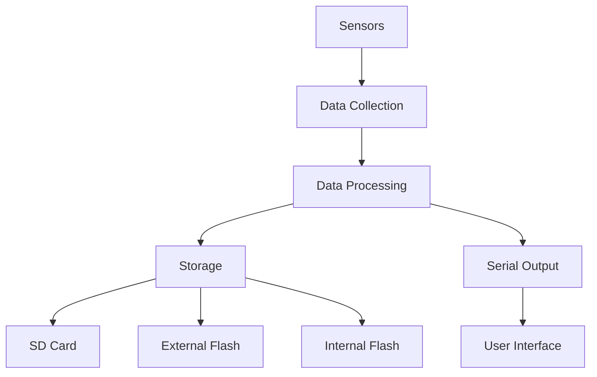

# TripleT Flight Firmware Documentation

## System Overview

TripleT Flight Firmware is an advanced flight controller software designed for model rockets and high-power rocketry applications. Built for the Teensy 4.0/4.1 microcontroller, it provides robust sensor integration, multi-target data logging, and a command-driven interface for configuration and data retrieval.

### Key Features
- Multi-sensor integration (GPS, barometer, accelerometer, 9-DOF IMU)
- Triple redundant data logging (SD card, external flash, internal flash)
- Efficient LittleFS implementation for internal flash storage
- Comprehensive data collection and logging
- Interactive serial interface
- Diagnostic tools and status monitoring
- Configurable logging rates and data formats

## Hardware Requirements

### Core Components
- **Microcontroller**: Teensy 4.0/4.1
- **Sensors**:
  - SparkFun ZOE-M8Q GPS Module (I2C address 0x42)
  - MS5611 Barometric Pressure Sensor (I2C address 0x77)
  - SparkFun KX134 Accelerometer (I2C address 0x1F)
  - SparkFun ICM-20948 9-DOF IMU (I2C address 0x69)
- **Storage**:
  - SD Card (SPI interface)
  - External Serial Flash (optional)
  - Internal Teensy Flash (512KB dedicated for logging)

### Optional Components
- Buzzer (pin 23)
- WS2812 LEDs (pin 7)
- Servo motors for TVC (pins 0, 1)
- Pyro channels (pins 5, 6, 7, 8)

## System Architecture

### Data Flow

### Core Components
1. **Sensor Management**
   - GPS data collection and processing
   - Barometric pressure and temperature monitoring
   - Accelerometer and IMU data acquisition
   - Sensor calibration and validation

2. **Data Logging System**
   - Multi-target storage implementation
   - Efficient binary data format
   - Configurable logging rates
   - Data integrity checks

3. **User Interface**
   - Serial command interface
   - Status monitoring
   - Data retrieval tools
   - Configuration management

## Function Reference

### Core Functions

#### Initialization Functions
- `setup()`: Main initialization function
  - Initializes all hardware components
  - Sets up storage systems
  - Configures sensors
  - Creates initial log files

- `initSDCard()`: SD card initialization
  - Configures SPI interface
  - Mounts SD card
  - Creates log directory structure

- `initSerialFlash()`: External flash initialization
  - Configures SPI interface
  - Initializes flash memory
  - Sets up file system

- `initInternalFlash()`: Internal flash initialization
  - Configures LittleFS
  - Creates log file structure
  - Sets up binary logging format

#### Sensor Functions
- `gps_init()`: GPS module initialization
  - Configures I2C interface
  - Sets up GPS module
  - Configures update rates

- `ms5611_init()`: Barometer initialization
  - Configures I2C interface
  - Sets up pressure sensor
  - Performs initial calibration

- `kx134_init()`: Accelerometer initialization
  - Configures I2C interface
  - Sets up accelerometer
  - Configures measurement ranges

- `ICM_20948_init()`: IMU initialization
  - Configures I2C interface
  - Sets up IMU
  - Configures measurement modes

#### Data Collection Functions
- `gps_read()`: GPS data collection
  - Reads position data
  - Updates fix status
  - Collects satellite information

- `ms5611_read()`: Barometer data collection
  - Reads pressure
  - Reads temperature
  - Calculates altitude

- `kx134_read()`: Accelerometer data collection
  - Reads acceleration values
  - Updates calibration
  - Processes raw data

- `ICM_20948_read()`: IMU data collection
  - Reads accelerometer data
  - Reads gyroscope data
  - Reads magnetometer data

#### Logging Functions
- `WriteLogData()`: Main logging function
  - Formats sensor data
  - Writes to all storage targets
  - Manages logging rates
  - Handles data integrity

- `createNewLogFile()`: Log file creation
  - Generates timestamped filename
  - Creates file structure
  - Writes header information

- `dumpInternalFlashData()`: Data retrieval
  - Reads binary log files
  - Converts to human-readable format
  - Outputs to serial interface

#### Utility Functions
- `checkStorageSpace()`: Storage monitoring
  - Checks available space
  - Monitors usage
  - Handles low space conditions

- `printStatusSummary()`: Status display
  - Shows sensor status
  - Displays storage information
  - Reports system health

- `printHelpMessage()`: Command help
  - Lists available commands
  - Shows usage information
  - Provides system status

## Data Format

### Binary Log Format
Each log record consists of 52 bytes:
1. Timestamp (4 bytes)
2. GPS fix type and satellite count (2 bytes)
3. Latitude (4 bytes)
4. Longitude (4 bytes)
5. Altitude (4 bytes)
6. Speed (2 bytes)
7. Pressure (2 bytes)
8. Temperature (2 bytes)
9. KX134 accelerometer values (6 bytes)
10. ICM-20948 accelerometer values (6 bytes)
11. ICM-20948 gyroscope values (6 bytes)
12. ICM-20948 magnetometer values (6 bytes)
13. Checksum (2 bytes)

### CSV Log Format
- Timestamp
- GPS information (fix type, satellites, position, altitude, speed)
- Barometric data (pressure, temperature)
- Accelerometer readings (X, Y, Z in g)
- IMU data (accelerometer, gyroscope, magnetometer)

## Command Reference

### Available Commands
| Command | Description |
|---------|-------------|
| `help`  | Shows available commands and system status |
| `dump`  | Dumps internal flash data to serial output |
| `erase` | Erases all internal flash log files |
| `list`  | Lists all log files in internal flash |
| `stats` | Shows detailed storage statistics |
| `detail`| Toggles detailed display mode |
| `imu`   | Shows detailed IMU data |
| `calibrate` | Performs barometric calibration |

## Configuration

### Logging Rates
- SD Card: 10Hz (every 100ms)
- External Flash: 10Hz (every 100ms)
- Internal Flash: 5Hz (every 200ms)

### Sensor Polling Intervals
- GPS: 5Hz (every 200ms)
- IMU: 10Hz (every 100ms)
- Barometer: 10Hz (every 100ms)
- Accelerometer: 10Hz (every 100ms)

### Storage Configuration
- Internal Flash Size: 512KB
- SD Card: FAT32 format
- External Flash: Serial Flash interface

## Troubleshooting

### Common Issues
1. **No GPS Fix**
   - Check antenna connection
   - Verify clear sky view
   - Monitor satellite count

2. **Storage Issues**
   - Check SD card format
   - Verify flash connections
   - Monitor available space

3. **Sensor Errors**
   - Check I2C connections
   - Verify power supply
   - Monitor error messages

### Diagnostic Tools
- I2C scanner
- Storage space monitor
- Sensor status display
- Data integrity checks

## Future Enhancements
- Flight state detection
- Parachute deployment control
- Thrust vector control
- Enhanced telemetry
- Power management
- User-configurable settings

## License
This project is licensed under the GNU General Public License v3.0 (GPL-3.0).

## Contributing
Contributions are welcome! Please follow the contribution guidelines in the repository. 