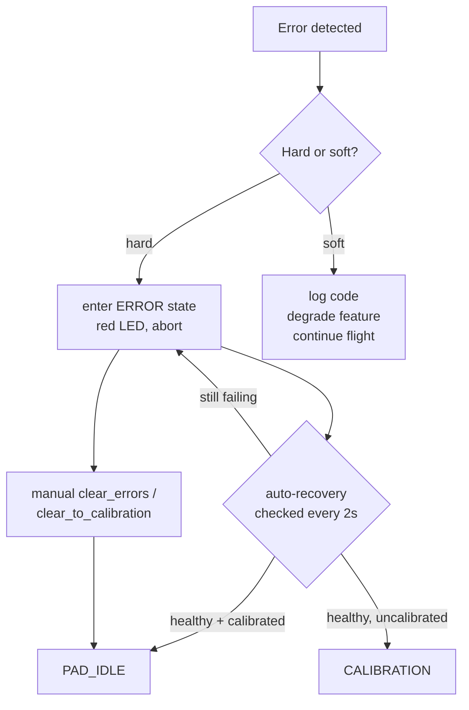

Error handling uses a single `ErrorCode_t` enum (`src/error_codes.h`) and a two-track response model: **hard errors** trigger the `ERROR` state (red LED, abort); **soft errors** log and continue with graceful degradation.

## Error Code Table (authoritative: `src/error_codes.h`)

| Range | Category | Examples |
|-------|----------|----------|
| 0 | No error | `NO_ERROR` |
| 10–29 | Sensor init failures | `SENSOR_INIT_FAIL_MS5611` (10), `SENSOR_INIT_FAIL_ICM20948` (11), `SENSOR_INIT_FAIL_KX134` (12), `SENSOR_INIT_FAIL_GPS` (13) |
| 30–49 | Sensor read failures | `SENSOR_READ_FAIL_MS5611` (30), `SENSOR_READ_FAIL_ICM20948` (31), `SENSOR_READ_FAIL_KX134` (32), `SENSOR_READ_FAIL_GPS` (33) |
| 50–59 | SD / logging | `SD_CARD_INIT_FAIL` (50), `SD_CARD_MOUNT_FAIL` (51), `LOG_FILE_CREATE_FAIL` (52), `SD_CARD_WRITE_FAIL` (53), `SD_CARD_LOW_SPACE` (54, warn only) |
| 60–69 | Calibration | `BARO_CALIBRATION_FAIL_NO_GPS` (60), `BARO_CALIBRATION_FAIL_TIMEOUT` (61), `MAG_CALIBRATION_LOAD_FAIL` (62) |
| 70–79 | State machine | `STATE_TRANSITION_INVALID_HEALTH` (70), `ARM_FAIL_HEALTH_CHECK` (71) |
| 80–89 | EEPROM | `EEPROM_SIGNATURE_INVALID` (80) |
| 90–99 | Guidance (soft) | `GUIDANCE_STABILITY_FAIL` (90), `GUIDANCE_TARGET_NOT_SET` (91) |
| 250–254 | Config | `CONFIG_ERROR_MAIN_PARACHUTE` (250, e.g. `MAIN_PRESENT` false at runtime) |
| 255 | Unknown | `UNKNOWN_ERROR` |

## Hard vs Soft Errors

**Hard errors** (10–89, 250–254) → transition to `ERROR` state, red LED, abort flight operations. Auto-recovery is checked every 2 s (hard-coded `autoRecoveryCheckInterval`, `src/flight_logic.cpp:202`; `ERROR_RECOVERY_ATTEMPT_MS` = 10 s is defined but unused); returns to `PAD_IDLE` if sensors recover and the baro is calibrated, or to `CALIBRATION` if healthy but uncalibrated. Manual override via `clear_errors` (→ `PAD_IDLE`) or `clear_to_calibration` (→ `CALIBRATION`). On every exit from `ERROR`, `g_last_error_code` is reset to `NO_ERROR`.

**Soft errors** (90–99) → log `g_last_error_code`, continue flight. Example: `GUIDANCE_STABILITY_FAIL` sets `g_guidance_active = false`, centers servos, switches LED to orange, but apogee detection and parachute deployment proceed normally. See [[concepts/guidance-degradation]].

## Recovery Paths

## Diagnostic Commands

| Command | Purpose |
|---------|---------|
| `status` | System status incl. per-sensor health summary |
| `sensor_requirements` | Sensor requirements vs. current state |
| `scan_i2c` | List responding I2C devices |
| `clear_errors` | Manually reset `ERROR` state to `PAD_IDLE` (only valid while in `ERROR`) |
| `clear_to_calibration` | Reset `ERROR` state to `CALIBRATION` (only valid while in `ERROR`) |

See [[entities/command-processor]] for the full command catalogue.

## Sensor Health Algorithm

The live check is `isSensorSuiteHealthy()` (`src/utility_functions.cpp:406`), evaluated by the state machine on state changes and its periodic health poll:

1. **Init flags** — per-sensor initialization status (`ms5611_initialized_ok`, `g_icm20948_ready`, `g_kx134_initialized_ok`, GPS init); baro failure is warn-only before arming.
2. **Calibration gate** — barometer must be calibrated once past `CALIBRATION`.
3. **IMU minimum** — at least one working IMU required for `ARMED` through `LANDED`.
4. **GPS sanity** — implausible fix types (> 5) and satellite counts (> 100) rejected at read time.

A richer validator (`SensorValidator`, `src/sensor_validator.h`) with response/freshness windows, range checks (accel ±100 m/s², altitude 0–50 km, descent rate < 500 m/s), cross-sensor consistency, and 3-strike failure counting exists in the tree but is **dormant — never instantiated**; none of those checks run in the flight build.

## Graceful-Degradation Modes

| Missing sensor | Effect |
|----------------|--------|
| KX134 | ICM-20948 only for acceleration; no high-G fallback above 16 g saturation |
| GPS | Barometer + accel apogee methods still fire (OR logic); audio/strobe beacon still operates without position |
| Barometer | GPS + accel apogee methods only (degrades apogee accuracy) |
| Primary IMU (ICM) | KX134 backup for accel magnitude (liftoff/burnout/landing detection); accel apogee method lost, baro/GPS/timer remain; no orientation (no Kalman input) → guidance disabled |

## Post-Flight Diagnosis

All errors are logged to the CSV (`error_code` column) — see [[concepts/data-logging]]. Walk through the log to correlate error codes with flight-state timings.

## Related

- [[concepts/guidance-degradation]] — soft-error code 90 handling
- [[concepts/sensor-redundancy]] — failover logic
- [[concepts/system-robustness]] — 4-layer defence model
