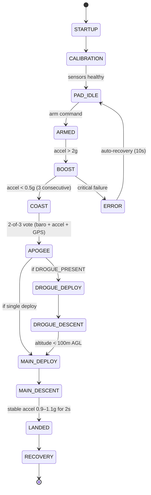

Flight computer firmware for a guided amateur rocket on Teensy 4.1 (ARM Cortex-M7). Handles sensor fusion, 14-state flight state machine, guidance/control, data logging, and post-flight recovery. Current version: **v0.10.0** (Safety Features phase complete).

## Tech Stack

| Layer | Technology |
|-------|-----------|
| MCU | Teensy 4.1 (ARM Cortex-M7 @ 600 MHz) |
| Framework | Arduino + PlatformIO |
| Build envs | `teensy41` (production), `native` (desktop unit tests) |
| Test framework | Unity + ArduinoFake |
| CI/CD | GitHub Actions (`.github/workflows/test.yml`) |

## Key Libraries

- `SparkFun_ICM-20948` — Primary IMU
- `SparkFun_u-blox_GNSS` — GPS receiver
- `MS5611` (RobTillaart) — Barometric altimeter
- `SparkFun_KX13X` — High-G accelerometer (backup)
- `Adafruit_NeoPixel` — Status LED
- `PWMServo`, `WDT_T4` — Servo control, watchdog (Teensy only)

## Directory Layout

```
src/
├── TripleT_Flight_Firmware.cpp   # Main loop, sensor reads, data logging
├── config.h                      # All compile-time parameters (SINGLE TRUTH)
├── data_structures.h             # LogData, FlightState enum, Trajectory types
├── debug_flags.h                 # Granular debug output control
├── flight_logic.cpp/.h           # State machine transitions, apogee/landing detect
├── state_management.cpp/.h       # EEPROM persistence of flight state
├── guidance_control.cpp/.h       # PID guidance, trajectory following
├── guidance_failsafe.cpp         # Stability-triggered failsafe escalation
├── stability_monitor.cpp/.h      # Real-time angular rate / attitude monitoring
├── kalman_filter.cpp/.h          # Kalman-based AHRS (gyro predict + accel update)
├── command_processor.cpp/.h      # Serial command handling
├── log_format_definition.cpp/.h  # CSV headers and log format
├── servo_smoother.cpp/.h         # Rate-limited servo output
├── sensor_validator.h            # Cross-sensor sanity checks
├── utility_functions.cpp/.h      # Shared math, hypsometric formula
├── apogee_detector.h             # Multi-path apogee voting logic
├── watchdog_recovery.h           # Watchdog reset recovery helpers
├── gps_functions.cpp/.h          # GPS driver wrapper
├── icm_20948_functions.cpp/.h    # ICM-20948 driver wrapper
├── kx134_functions.cpp/.h        # KX134 driver wrapper
├── ms5611_functions.cpp/.h       # MS5611 driver wrapper
├── hal/                          # Hardware Abstraction Layer (Phase 1)
│   ├── hal_interfaces.h          # 8 pure-virtual interfaces
│   ├── teensy_hal.h              # Production Teensy implementations
│   ├── mock_hal.h                # Mock implementations for desktop tests
│   ├── hal_factory.h             # Compile-time HAL selection
│   └── hal_config.cpp            # Global g_timer, g_serial, etc. init
└── sensors/                      # Sensor Modularity Layer (Phase 2)
    ├── imu_interface.h           # IMUInterface — 20 pure-virtual methods
    ├── icm20948_sensor.h         # ICM-20948 adapter
    ├── kx134_sensor.h            # KX134 high-G adapter
    ├── bno085_sensor.h           # BNO085 stub (future evaluation)
    ├── imu_manager.h             # Dual-sensor redundancy + failover
    ├── sensor_factory.h/.cpp     # Factory pattern for sensor selection
    └── sensor_factory.cpp
test/
├── unit/                         # Unity test files (run on native)
│   ├── test_state_machine.cpp
│   ├── test_apogee_detection.cpp
│   ├── test_guidance_failsafe.cpp
│   ├── test_math_functions.cpp
│   ├── test_servo_smoother.cpp
│   └── test_stability_monitor.cpp
└── mocks/                        # Mock sensor implementations
web_interface/                    # Real-time data visualization (Web Serial API)
esp32_ground_station_receiver/    # ESP32 telemetry ground station
esp32_telemetry_transmitter/      # ESP32 telemetry transmitter
```

## Flight State Machine

14 states managed in `src/flight_logic.cpp` and persisted to EEPROM via `src/state_management.cpp`:



## Data Pipeline

```
Sensors (20-100ms) → Kalman Filter (AHRS) → Flight Logic → Guidance/PID
       ↓                                                         ↓
  Data Logging (CSV on SD) ←────── LogData struct ──────── Actuators (servos, pyros)
       ↓
  Web Interface (Web Serial API, real-time)
```

## Critical Design Decisions

See [[concepts/hal-abstraction]], [[concepts/sensor-redundancy]], [[concepts/apogee-detection]], [[concepts/guidance-degradation]].

1. **HAL abstraction** — enables desktop unit testing without Teensy hardware
2. **IMUInterface adapters** — runtime polymorphism for sensor swap/failover
3. **2-of-3 apogee voting** — barometer + accelerometer + GPS; backup timer at 20s
4. **EEPROM state persistence** — survives power-loss and watchdog resets
5. **Kalman filter** — replaces deprecated Madgwick; handles gyro + accel + GPS altitude
6. **Graceful guidance degradation** — stability failure disables guidance (orange LED), does NOT trigger ERROR state; parachutes still deploy normally
