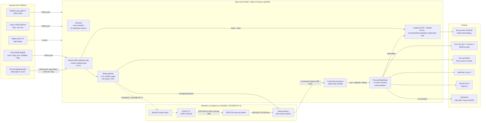
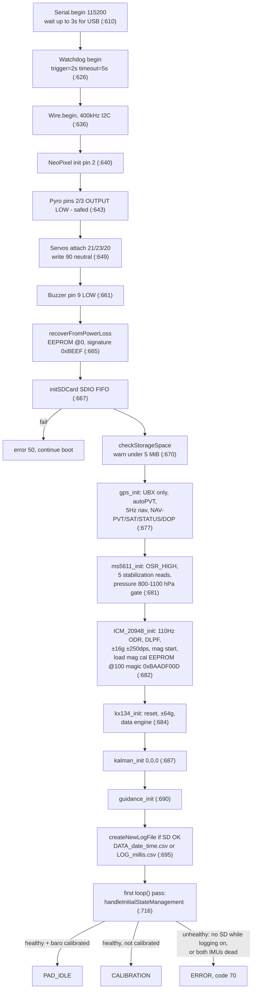
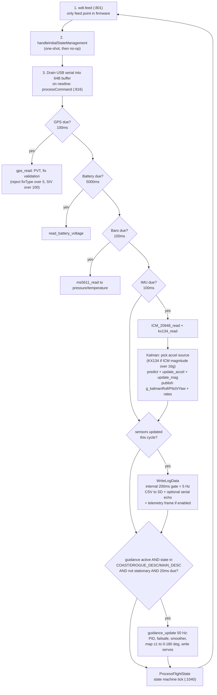
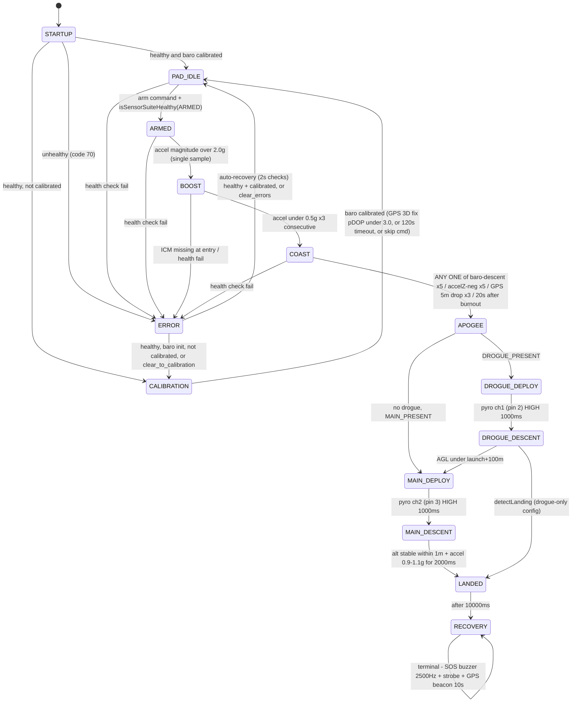
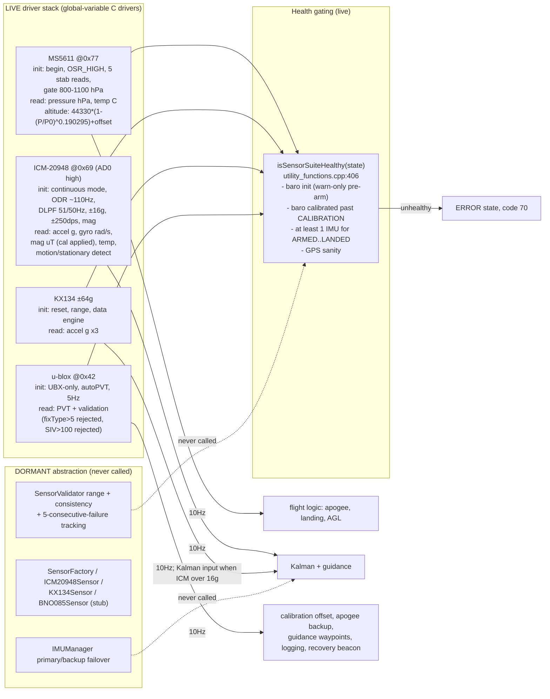
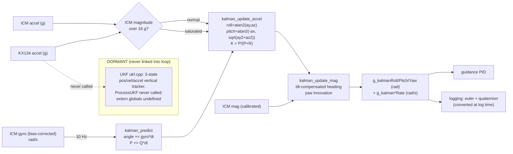
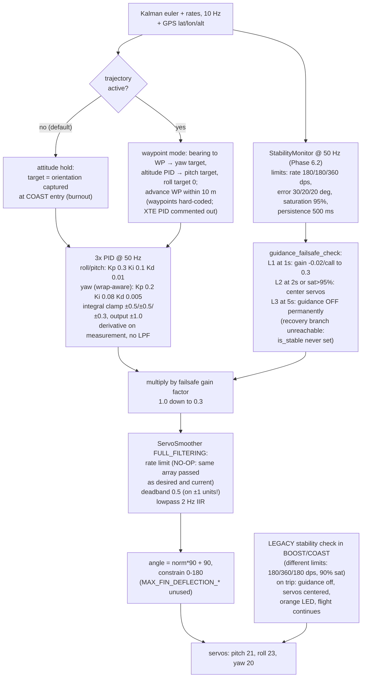
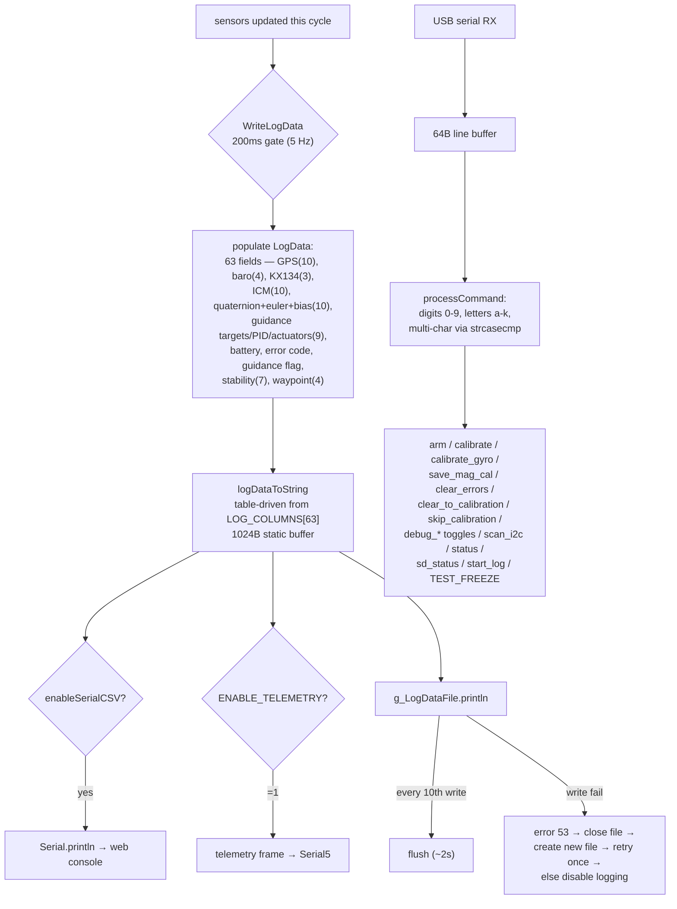
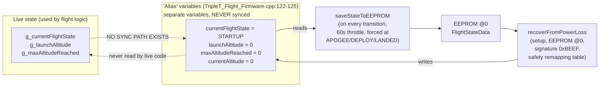

# System Workflow Audit — 2026-07

This is a **code-derived** map of every subsystem workflow in the firmware as it actually compiles and runs (`env:teensy41`, `ENABLE_GUIDANCE=1`, `USE_KX134=1`, `ENABLE_TELEMETRY=0`), followed by a claim-by-claim comparison against the wiki. Per [[schema]], *source code always wins over wiki* — every statement below cites `file:line` ground truth. Diagrams are Mermaid (rendered by GitHub).

**Reading guide:** solid arrows = live runtime data flow; dashed arrows/grey boxes = code that exists but is **never executed** in the flight build.

---

## 1. Master System Map

How every subsystem connects at runtime. Rates shown on edges.

Key structural facts of the running system:

- **Everything is polled from one cooperative loop** — there are no interrupts or RTOS tasks. Sensor polls at 10 Hz, guidance at 50 Hz, logging at 5 Hz, all gated by `millis()` comparisons.
- **The HAL layer (`src/hal/`) and OO sensor stack (`src/sensors/`) are dead code** in the flight build (§10). The loop calls `Wire`/`Serial`/`EEPROM`/`SdFat` and the C-style sensor drivers directly.
- **Telemetry is compiled out by default** (`ENABLE_TELEMETRY 0`, `config.h:61`) and, even when enabled, the radio downlink terminates at the ground station's USB port — the web dashboard cannot parse it (§9).
- **Pin 2 is double-assigned**: `PYRO_CHANNEL_1` (`config.h:30`) and `NEOPIXEL_PIN` (`config.h:90`) are the same GPIO. The NeoPixel is initialized on pin 2 (`setup()` :640) and pin 2 is then re-driven as the drogue pyro output (:643).

---

## 2. Boot & Initialization Workflow

`setup()` — `src/TripleT_Flight_Firmware.cpp:608-713`, plus the one-shot `handleInitialStateManagement()` on the first loop pass (:716-798).

Step-by-step detail (all cited from `setup()` unless noted):

1. **Serial** at 115200; non-blocking wait max 3 s; prints banner with `TRIPLET_FLIGHT_VERSION` = **0.51** (:38) — note this differs from `FIRMWARE_VERSION "v0.10.0"` in `config.h:9`.
2. **Watchdog**: `WDT_T4<WDT1>`; `trigger=2`, `timeout=5` — **units are seconds**, so hardware reset fires after **5 s** without a feed. The in-code comment "2.0s timeout" (:626) and `WATCHDOG_TIMEOUT_MS=1000` (`config.h:177`, never referenced) are both wrong/unused. No callback is registered, so the 2 s pre-warning interrupt is inert.
3. **I2C** at 400 kHz; **NeoPixel** (2 pixels, pin 2, brightness 50); **pyro channels safed LOW** (pins 2 and 3 — see the pin-2 conflict above); **servos** attached and centered at 90°; **buzzer** low.
4. **Power-loss recovery** — `recoverFromPowerLoss()` (`state_management.cpp:87-194`) reads `FlightStateData` from EEPROM address 0, validates signature `0xBEEF`, and maps the saved state to a safe resume state (ARMED→PAD_IDLE, BOOST/COAST→DROGUE_DESCENT, MAIN_DESCENT/LANDED→RECOVERY, etc.). **However, this entire path is neutralized by a latent bug**: it writes the resume state into `currentFlightState` — a variable *commented* "Alias for g_currentFlightState" (`TripleT_Flight_Firmware.cpp:122`) but which is a **separate variable never read by the live state machine**. See §11.
5. **SD init** via built-in SDIO. Failure sets error 50 and boot continues; SD absence only becomes fatal at the first-loop health check if `g_loggingEnabled` is true.
6. **Sensor inits** set per-sensor ready flags (`ms5611_initialized_ok`, `g_icm20948_ready`, `g_kx134_initialized_ok`, `g_gps_initialized_ok`); all failures are non-fatal at this point. ICM init also loads magnetometer hard/soft-iron calibration from EEPROM @100 (falls back to hard-coded defaults from `calibrate3.py`).
7. **Kalman + guidance init**, then **log file creation** with dynamically generated 63-column CSV header from `LOG_COLUMNS[]`.
8. **First-loop state decision** (`handleInitialStateManagement`): `systemHealthy` is false if (`!g_sdCardAvailable && g_loggingEnabled`) or both IMUs failed; a missing barometer is only a warning. Healthy → PAD_IDLE (if `g_baroCalibrated`) or CALIBRATION; unhealthy → ERROR with `STATE_TRANSITION_INVALID_HEALTH` (70).

**Boot failure policy summary:** SD fail → recorded, boot continues, unhealthy only if logging enabled. Both IMUs fail → ERROR. Baro fail → warning, degraded operation permitted.

---

## 3. Main Loop Scheduling

`loop()` — `src/TripleT_Flight_Firmware.cpp:800-1062`. Single cooperative pass, order fixed:

**Timing table** (as compiled — several documented constants are not what actually runs):

| Activity | Actual cadence | Governing code | Notes |
|---|---|---|---|
| Watchdog feed | every iteration | `:801` | Hardware reset if any single iteration blocks > 5 s |
| Serial command drain | every iteration | `:816-877` | 64-byte buffer, overflow resets with error |
| GPS read | 100 ms | `GPS_POLL_INTERVAL`, `constants.h:12` | Module solves at 5 Hz internally |
| Baro read | 100 ms | `BARO_POLL_INTERVAL` | |
| IMU + KX134 read + Kalman | 100 ms | `IMU_POLL_INTERVAL` | Kalman dt sanity window 0 < dt < 1.0 s (`:957`) |
| Battery read | 5000 ms | `BATTERY_VOLTAGE_READ_INTERVAL_MS`, `config.h:361` | |
| Data logging | **200 ms (5 Hz)** | hard-coded `:331` | `LOG_INTERVAL=100` in `constants.h` is **unused** |
| SD flush | every 10 writes (~2 s) | `:516` | |
| Guidance + servo write | 20 ms (50 Hz) | `GUIDANCE_UPDATE_INTERVAL_MS`, `:182` | Only in COAST / DROGUE_DESCENT / MAIN_DESCENT and while moving |
| State machine tick | every iteration | `:1040` | Internal 1000 ms health-check and broadcast throttles |
| EEPROM state save | 60 s throttle | `EEPROM_UPDATE_INTERVAL` | Forced immediately at APOGEE / DROGUE_DEPLOY / MAIN_DEPLOY / LANDED |

---

## 4. Flight State Machine

`ProcessFlightState()` — `src/flight_logic.cpp:111-993`, called every loop. 14 states (`data_structures.h:9-24`). Entry actions run once on transition (first switch, :327-490); guards/transitions evaluate every pass (second switch, :492-992).

### 4.1 Per-state actions & guards (all thresholds as compiled)

| State | Entry actions (one-shot) | Exit condition | LED |
|---|---|---|---|
| STARTUP (0) | — (handled by first-loop init management) | health + calibration decision | dark red |
| CALIBRATION (1) | debug print | `g_baroCalibrated`; auto-cal needs `GPS_fixType>=3 && pDOP<300` (pDOP < 3.0) and pressure 700–1200 hPa; fallback after `CALIBRATION_AUTO_TIMEOUT_MS`=120 s forces offset 0 (`flight_logic.cpp:499-562`) | orange |
| PAD_IDLE (2) | latch `g_launchAltitude`; zero max-alt trackers; **safe both pyro pins LOW** (:336-346) | `arm` command only (gated by `isSensorSuiteHealthy(ARMED)`) | green |
| ARMED (3) | compute `g_main_deploy_altitude_m_agl` = current AGL + `MAIN_DEPLOY_HEIGHT_ABOVE_GROUND_M` (100 m) (:347-369) | accel magnitude > `BOOST_ACCEL_THRESHOLD` 2.0 g (:569). **No arming timeout**: `ARMED_TIMEOUT_MS` (300 s) is defined but never referenced; there is no `disarm` command | yellow |
| BOOST (4) | ERROR if Kalman on and ICM dead; reset max-alt (:370-382) | `detectBoostEnd()`: accel < `COAST_ACCEL_THRESHOLD` 0.5 g for `COAST_CONFIRMATION_COUNT` 3 consecutive reads (:995-1010); sets `boostEndTime` | magenta |
| COAST (5) | reset apogee counters; capture attitude-hold target from Kalman orientation at burnout (:383-422) | `detectApogee()` (see §4.2) | cyan |
| APOGEE (6) | print peak | immediate same-cycle branch on `DROGUE_PRESENT`/`MAIN_PRESENT`; `APOGEE_DELAY` (1000 ms) defined but **unused** (:671-683) | white |
| DROGUE_DEPLOY (7) | — | pin 2 HIGH, LOW after `PYRO_FIRE_DURATION` 1000 ms, then DROGUE_DESCENT (:684-707) | red x2 |
| DROGUE_DESCENT (8) | — | AGL < `g_main_deploy_altitude_m_agl` → MAIN_DEPLOY; or landing if no main (:708-719) | dark red |
| MAIN_DEPLOY (9) | — | pin 3 HIGH, LOW after 1000 ms → MAIN_DESCENT (:720-743) | blue x2 |
| MAIN_DESCENT (10) | latch landing-check altitude | `detectLanding()` (:744-748) | dark blue |
| LANDED (11) | — | `LANDED_TIMEOUT_MS` 10 000 ms → RECOVERY (:749-753) | indigo |
| RECOVERY (12) | — | terminal. SOS morse on buzzer (2500 Hz; dot 200 ms, dash 600 ms), white LED strobe 100 ms on / 900 ms off, GPS position print every 10 s (:754-981). `RECOVERY_TIMEOUT_MS` (5 min) defined but **unused** | strobe |
| ERROR (13) | 2500 Hz beep every 200 ms; error print every 5 s (:452-482) | auto-recovery evaluated **every 2000 ms** (`autoRecoveryCheckInterval`, :199-236) when `isSensorSuiteHealthy(PAD_IDLE)`; or `clear_errors` / `clear_to_calibration` commands. `ERROR_RECOVERY_ATTEMPT_MS` (10 s) defined but **unused**. 5 s grace period after clearing suppresses re-checks | red |

### 4.2 Apogee detection — actual algorithm

`detectApogee()` (`flight_logic.cpp:1028-1086`) runs only in COAST. It is **OR / first-match, not voting** — each later method is guarded by `!apogeeDetected`, and any single method fires the transition:

1. **Barometric (primary):** `ms5611_get_altitude() < g_maxAltitudeReached` for `APOGEE_CONFIRMATION_COUNT` = 5 consecutive reads. ⚠️ **Unit defect:** `g_maxAltitudeReached` is tracked in **AGL** (:608, :668) but compared against **absolute** altitude — at any launch site meaningfully above sea level the comparison is almost never true, effectively disabling the primary method (calibrated absolute altitude always exceeds the AGL max).
2. **Accelerometer:** `icm_accel[2] < 0.0f` for 5 reads. (`APOGEE_ACCEL_THRESHOLD` −0.1 g and `APOGEE_ACCEL_SAMPLES` are defined but **unused** — the live check uses 0.0 and `APOGEE_ACCEL_CONFIRMATION_COUNT`.)
3. **GPS:** altitude ≥ 5 m below the tracked GPS max (hard-coded 5.0) for 3 reads, requires any fix.
4. **Backup timer (failsafe):** `millis() − boostEndTime > BACKUP_APOGEE_TIME_MS` = 20 000 ms.

A full **2-of-3 voting** implementation exists in `src/apogee_detector.h` (`ApogeeDetector` class, votes ≥ 2 of baro/accel/GPS with a 60 s timeout) but is **never instantiated** anywhere in `src/` — it is dormant (§10).

### 4.3 Landing detection

`detectLanding()` (`flight_logic.cpp:1088-1125`): 10-sample moving average of baro altitude; requires `|avgAlt − g_launchAltitude| < 1.0 m` **and** accel magnitude within 0.9–1.1 g, both held continuously for `LANDING_CONFIRMATION_TIME_MS` = 2000 ms. (`LANDING_CONFIRMATION_COUNT` in config is unused; the 10 is a literal.)

---

## 5. Sensor Subsystem Workflows

### 5.1 Per-sensor step detail

**MS5611 barometer** (`ms5611_functions.cpp`)
- Init (:250-306): `begin()` → fail sets error 10; `setOversampling(OSR_HIGH)`; 5 stabilization reads at 100 ms spacing (feeding the watchdog); final validity gate requires ≥1 OK read and pressure ∈ [800, 1100] hPa.
- Read (:50-57): library runs the D1/D2 conversion + PROM compensation internally; copies to globals `pressure`/`temperature`. Polled at 10 Hz, gated on `MS5611_READ_OK`.
- Altitude (:207-222): hypsometric `44330·(1−(P/P0)^0.190295) + baro_altitude_offset`, P0 = 1013.25 hPa. ⚠️ The logger recomputes raw altitude inline with exponent **0.1903** (`TripleT_Flight_Firmware.cpp:351`) — two slightly different exponents coexist.
- No auto-reinit on failure; unhealth surfaces via `ms5611_initialized_ok`.

**ICM-20948 IMU** (`icm_20948_functions.cpp`)
- Init (:132-248): `begin(Wire, 1)` = addr 0x69; continuous accel+gyro; sample-rate divider 9 (~110 Hz ODR — header comment says 100 Hz); DLPF cfg 7 both; FSR accel ±16 g / gyro **±250 dps**; magnetometer startup; loads mag calibration from EEPROM @100 (magic `0xBAADF00D`, 52-byte block: bias[3] + scale[3][3]).
- Read (:271-381): accel mg→g, gyro dps→rad/s, mag with hard/soft-iron correction applied in place; temp; **stationary detection** (gyro magnitude < 0.03 rad/s and accel variance < 0.008 g with 5-count hysteresis) → global `isStationary` which suppresses guidance.
- Gyro bias: `ICM_20948_calibrate_gyro_bias(2000, 1)` on command only (not at boot); bias subtracted at `ICM_20948_get_calibrated_gyro()` feeding Kalman predict.
- ⚠️ `ICM_20948_calibrate_mag_interactive()` is an **empty stub** — the `calibrate_mag` command does nothing.

**KX134 high-G accel** (`kx134_functions.cpp:15-72`): begin → software reset → ±64 g range → data engine → enable. Read copies 3 floats (g). Its only live consumer beyond logging: Kalman accel source when ICM magnitude exceeds 16 g (`TripleT_Flight_Firmware.cpp:929-955`), plus liftoff/landing via `get_accel_magnitude()` (prefers KX134).

**GPS** (`gps_functions.cpp:71-204`): I2C @0x42 (SPI path exists behind `GPS_USE_SPI=0`); config = UBX-only output, autoPVT, **5 Hz** nav rate, NAV-PVT/SAT/STATUS/DOP enabled. Read validates: raw fixType > 5 ⇒ treated as corrupt (fix forced 0), SIV > 100 ⇒ 0. Time latched only with a fix. ⚠️ **No dynamic model is configured** (`setDynamicModel` never called) — the u-blox default model may clip velocity/altitude tracking during boost.

**BNO085**: pure placeholder (`sensors/bno085_sensor.h`), all methods return false/0; selectable only via flags never defined (one of them misspelled `USE_BONO85_BACKUP`).

### 5.2 Calibration workflows

| Calibration | Trigger | Procedure | Persistence |
|---|---|---|---|
| Barometer ground reference | auto in CALIBRATION state; or `calibrate` command (PAD_IDLE/CALIBRATION/ERROR); or `skip_calibration` | needs GPS 3D fix + pDOP < 3.0 + pressure 700–1200 hPa; `offset = GPS_alt_m − raw_baro_alt`; 120 s timeout falls back to offset 0 | RAM only (offset itself not persisted; `g_baroCalibrated` survives via EEPROM state struct — but see §11 bug) |
| Gyro bias | `calibrate_gyro` command | discard 100 reads, average 2000 samples → `gyroBias[3]` rad/s | RAM only |
| Magnetometer hard/soft iron | `save_mag_cal` command (interactive capture is a stub) | defaults hard-coded from `calibrate3.py`; corrected each read: `scale · (raw − bias)` | EEPROM @100, magic `0xBAADF00D`, loaded at ICM init |

---

## 6. State Estimation Workflow

**What the Kalman filter actually is** (`kalman_filter.cpp`): a **3-state decoupled scalar filter** — `kf_roll/kf_pitch/kf_yaw` with a diagonal-only covariance `P_diag[3]`. There are **no gyro-bias states** (bias is handled upstream as a calibration constant). Hard-coded noise: `Q_angle = 0.001`, `R_accel = 0.03`, `R_mag = 0.03`, initial P = 1.0. Predict is direct Euler integration (no kinematic tan/sec coupling — the correct form is present but commented out). Accel update corrects roll/pitch from the gravity vector; mag update corrects yaw with tilt compensation. ⚠️ The yaw innovation is **not wrap-normalized**, risking a transient at the ±π boundary. **Baro and GPS are not fused** — this filter is attitude-only; there is no altitude/velocity estimator in the live build.

**UKF** (`ukf.cpp`): a self-contained 3-state (pos/vel/accel) vertical-axis UKF with dual-accelerometer averaging. **Completely dormant**: `ProcessUKF()` is never called, and the file references extern globals (`ukf`, `ukf_pos`, `icm20948_ready`, …) that are defined nowhere — it would fail to link if invoked. Sigma-point code is also internally inconsistent (7 of the 11 required points, per-element sqrt instead of Cholesky).

---

## 7. Guidance & Control Workflow

Detail (all from `guidance_control.cpp`, `guidance_failsafe.cpp`, `servo_smoother.cpp`, `stability_monitor.cpp`):

- **Activation window:** servo-writing guidance runs only when `g_guidance_active` **and** state ∈ {COAST, DROGUE_DESCENT, MAIN_DESCENT} **and** `!isStationary` (`TripleT_Flight_Firmware.cpp:989`). During **BOOST** only the legacy stability check runs — there is **no active fin control during boost**.
- **Target:** at COAST entry the burnout attitude is captured as the hold target. Waypoint trajectory mode exists but ships with hard-coded placeholder waypoints (`guidance_control.cpp:744-768`) and the cross-track-error PID commented out (:872) — matching the roadmap's "6.1 partial" status.
- **PID:** derivative-on-measurement (anti-kick) computed from angle finite-difference — the passed-in gyro rate argument is unused, and there is no derivative low-pass. Yaw uses the angle-wrap-aware variant.
- **Failsafe escalation** (checked at 50 Hz inside `guidance_update`): trigger = any stability violation persisting ≥ 500 ms. Level 1 (≥1 s): progressive gain reduction to floor 0.3. Level 2 (≥2 s or saturation > 95 %): passive mode, servos centered at 90°. Level 3 (≥5 s): `g_guidance_active=false` permanently — flight continues, no ERROR state, parachute logic untouched. ⚠️ **Recovery is unreachable in flight**: it requires `metrics.is_stable == true`, but `StabilityMonitor::update()` never assigns `is_stable` (always false from memset). Only `guidance_failsafe_reset()` on a state transition restores gains.
- **Two divergent stability systems coexist**: the Phase-6.2 `StabilityMonitor` (limits 180/180/360 dps, sat 95 %) inside guidance_update, and the legacy `guidance_check_stability` (limits 180/**360**/180 dps, sat 90 %) called from the state machine in BOOST/COAST. Their roll/yaw rate limits are swapped relative to each other.
- **Servo smoother defects:** it is tuned in degrees but fed normalized ±1 commands — the 0.5 "degree" deadband therefore zeroes half the command range; and `smoothBatch(raw, raw, …)` passes the same array as desired *and* current, making the rate limiter compute a zero delta every call (no-op). Only deadband + 2 Hz low-pass have effect.

---

## 8. Data Logging & Command Console Workflow

- **File naming** (`createNewLogFile`, :222-294): `DATA_YYYYMMDD_HHMMSS.csv` with GPS fix, else `LOG_<millis>.csv`. Header generated from `LOG_COLUMNS[]` (single source of truth, 63 columns). ⚠️ Name built in a 64-byte local buffer but stored in a 32-byte global (truncation).
- **No RAM ring buffer, no preallocation**: `SD_BUF_SIZE`, `SD_CACHE_SIZE`, `LOG_PREALLOC_SIZE`, `MAX_LOG_ENTRIES`, `MAX_BUFFER_SIZE`, `DISABLE_SDCARD_LOGGING` are all defined and never referenced. Writes are direct `println` with a flush every 10 rows.
- **Rate is constant 5 Hz in every flight state**; the only variation is forced immediate logging on ERROR entry (`WriteLogData(true)`).
- **Command table** (complete, `command_processor.cpp:319-629`): digits `0`–`9` = CSV toggle, system/IMU/GPS/baro/storage/ICM-raw debug toggles, start-logging, SD status, shutdown; letters `a`–`j` = help, status, three flash stubs ("Not Implemented"), storage stats, display mode, baro calibrate, ICM print, summary toggle. Multi-char: `help`, `calibrate` (PAD_IDLE/CALIBRATION/ERROR only), `calibrate_mag` (stub), `calibrate_gyro`, `save_mag_cal`, `arm` (PAD_IDLE only), `clear_errors` / `clear_to_calibration` (ERROR only), `skip_calibration`, `summary`, `status`, `sd_status`, `start_log`, `debug_<flag> [on|off]`, `debug_all_off`, `set_orientation_filter`, `get_orientation_filter`, `scan_i2c`, `sensor_requirements`, `TEST_FREEZE` (6 s delay to test the watchdog). There is **no** `disarm`, no log dump/delete, no `status_sensors` handler (help text mentions it, but no handler exists).
- **Error codes** (`error_codes.h`): latched single `g_last_error_code`, logged in every CSV row; never auto-reset to `NO_ERROR` on recovery. ⚠️ `getErrorCodeName()` lacks cases for codes 90/91 (guidance errors → "UNDEFINED_ERROR_CODE").

---

## 9. Telemetry Chain Workflow

The repo contains **two downlink paths that do not connect end-to-end**:

```mermaid
flowchart LR
    subgraph TEENSY["Teensy 4.1"]
        WLD["WriteLogData 5 Hz"]
        PK["telemetry_pack: 40-byte packed struct<br/>ts, state, err, lat/lon e7, alt mm x2,<br/>accel mg x3, quat Q14 x4, batt mV,<br/>stability flags, guidance flag"]
        FR["telemetry_frame: 0xA5 + len 40<br/>+ payload + CRC-8/SMBUS(0x07)<br/>= 43 bytes"]
        CSVOUT["62/63-field CSV on USB serial<br/>(enableSerialCSV)"]
    end
    subgraph AIR["ESP32 transmitter (onboard)"]
        UP["UART2 RX GPIO16 @115200<br/>4-state frame parser + CRC check"]
        EN["esp_now_send unicast<br/>to ground_station_mac (placeholder)<br/>2.4 GHz, unencrypted, 40B payload"]
    end
    subgraph GND["ESP32 ground station"]
        RXC["on_data_recv: len==40 check<br/>(no RSSI, no sequence tracking)"]
        EMIT["USB serial @115200:<br/>TELEM,ts,state,err,lat,lon,altG,altB,<br/>ax,ay,az,q0..q3,vbat,stab,guid<br/>+ # status lines every 5s"]
    end
    subgraph PC["Browser (Chrome/Edge, Web Serial)"]
        PARSE["data_parser.js:<br/>JSON state msgs, servo lines,<br/>62-field numeric CSV"]
        UI["charts (Chart.js), 3D (Three.js),<br/>GPS/state/battery panels,<br/>command box"]
    end

    WLD -->|"ENABLE_TELEMETRY=1<br/>(default 0!)"| PK --> FR -->|"Serial5 TX pin 20"| UP --> EN --> RXC --> EMIT
    EMIT -.->|"TELEM lines NOT PARSED<br/>(first token non-numeric →<br/>falls to raw terminal log)"| PARSE
    WLD --> CSVOUT -->|"direct USB tether"| PARSE --> UI
    UI -->|"commands, direct USB only"| TEENSY
```

End-to-end facts:

1. **Compile gate:** the whole radio path is behind `ENABLE_TELEMETRY` = **0** (`config.h:61`). Even when enabled, the send sits *after* the SD-logging early-returns in `WriteLogData` — **no SD card ⇒ no telemetry packets**.
2. **Rate:** ~5 Hz (the `WriteLogData` 200 ms gate). `TELEMETRY_PERIOD_MS 100` ("10 Hz") is defined and never referenced.
3. **The Teensy firmware, ESP32 TX, and ESP32 RX are all real, complete implementations** — not stubs. The TX validates sync/len/CRC and forwards the bare 40-byte struct over ESP-NOW; the RX validates length and prints an 18-token `TELEM,` ASCII line. The TX ships with a placeholder ground-station MAC that must be replaced.
4. **The web dashboard cannot consume the radio feed**: its CSV branch requires the first token to be numeric and the field count to equal 62; `TELEM,...` fails both and lands in the raw terminal log. The charts are driven only by the **direct-USB CSV** from the Teensy. (The wiki's [[entities/esp32-telemetry]] correctly lists this parser branch as pending.)
5. **No uplink exists over radio** — commands reach the rocket only via direct USB.
6. The 40-byte `TelemetryPacket` struct is hand-duplicated in four files, guarded by `static_assert(sizeof==40)` (size drift caught; field-order drift not).

---

## 10. Dormant / Dead Code Inventory

Code that exists in `src/` but is provably not part of the executing flight build:

| Module | Evidence | Wiki treats it as |
|---|---|---|
| `src/hal/` (all 5 files) | `hal_init()` never called; `g_timer…g_watchdog` stay null; firmware calls Arduino APIs directly. Factory keys on `NATIVE_TEST_BUILD`, which no build env defines (`env:native` defines `UNIT_TEST_NATIVE`) | **Live Layer 0**, "shipped v0.7.0, zero overhead" (ADR-001) |
| `src/sensors/` OO stack (`IMUManager`, `SensorFactory`, adapters) | `g_imu_manager`/`initSensors()` referenced only within `src/sensors/` | **Live Layer 1** primary/backup failover (ADR-002) |
| `src/sensor_validator.h` | never instantiated outside its own header | the range/consistency/stuck-sensor checks in [[entities/error-handling]] |
| `src/apogee_detector.h` (2-of-3 voting class) | never instantiated in `src/` | **the** apogee algorithm (ADR-003, [[concepts/apogee-detection]]) |
| `src/ukf.cpp` | `ProcessUKF()` never called; extern globals undefined (would not link) | correctly flagged experimental in [[concepts/kalman-filter]] ✅ |
| `src/watchdog_recovery.h` (`WatchdogRecovery`) | never `#include`d by any compiled `.cpp`; EEPROM read inside is a TODO stub | the "RECOVERED_FROM_WATCHDOG" resume flow in [[concepts/system-robustness]] |
| `BNO085Sensor` | all methods return false/0; enabling flags never defined (one misspelled `USE_BONO85_BACKUP`) | optional alternative IMU (correctly marked stub) ✅ |
| ~20 config constants | `WATCHDOG_TIMEOUT_MS`, `ARMED_TIMEOUT_MS`, `APOGEE_DELAY`, `RECOVERY_TIMEOUT_MS`, `ERROR_RECOVERY_ATTEMPT_MS`, `APOGEE_BARO_DESCENT_THRESHOLD`, `APOGEE_ACCEL_THRESHOLD`, `APOGEE_ACCEL_SAMPLES`, `LANDING_CONFIRMATION_COUNT`, `MAX_FIN_DEFLECTION_*`, `LOG_INTERVAL`, `SD_CACHE_SIZE`, `LOG_PREALLOC_SIZE`, `SD_BUF_SIZE`, `MAX_LOG_ENTRIES`, `MAX_BUFFER_SIZE`, `TELEMETRY_PERIOD_MS`, `MAX_SENSOR_FAILURES`, `BAROMETER_ERROR_THRESHOLD`, `ACCEL_ERROR_THRESHOLD` | several are quoted in the wiki as live behavior |

---

## 11. Persistence & Watchdog — and the critical decoupling bug

`state_management.cpp:14-17` externs the non-`g_` variables; `saveStateToEEPROM()` reads them (:33-36) and `recoverFromPowerLoss()` writes them (:105+). They are defined in the main file with comments "Alias for g_…" but **no aliasing exists** — grep confirms `g_currentFlightState` appears zero times in `state_management.cpp`, and the alias variables are assigned nowhere outside it. Net effect, as compiled:

- **EEPROM always stores `STARTUP` with zeroed altitudes** regardless of flight phase (only `g_main_deploy_altitude_m_agl`, a real shared global, round-trips correctly).
- **Power-loss recovery restores state into a variable nothing reads** — after any in-flight brownout/watchdog reset, the vehicle re-enters STARTUP → CALIBRATION as if freshly powered.
- The wiki's entire mid-flight-recovery story ([[entities/state-management]], [[concepts/system-robustness]], ADR-004) describes the *intended* design, not the executing one.

**Watchdog reality:** WDT_T4 configured in `setup()` with **timeout = 5 s** (not the documented 1000 ms); fed only at the top of `loop()`; no reset-cause detection runs at boot (the `WatchdogRecovery` class that reads the i.MX RT SRC register is dead code), so a watchdog reset is indistinguishable from a power cycle — and either way, recovery is neutralized by the alias bug above.

---

## 12. Code vs Wiki Comparison

Verdicts: ✅ accurate · ⚠️ partially accurate / stale detail · ❌ contradicted by code. Wiki page named per claim.

### 12.1 Architecture & platform

| Wiki claim | Source | Code reality | Verdict |
|---|---|---|---|
| 4-layer architecture with enforced dependency rules; no direct Arduino calls above HAL | [[concepts/layered-architecture]] | Layers 0–1 (`hal/`, `sensors/`) exist but are never invoked; flight path calls `Wire`/`Serial`/`EEPROM`/`SdFat`/drivers directly | ❌ aspirational |
| HAL shipped v0.7.0, zero binary overhead | ADR-001 | `hal_init()` never called; zero overhead because zero use. Factory macro `NATIVE_TEST_BUILD` isn't defined by any build env | ❌ |
| IMUManager primary→backup failover live, transparent to flight logic | ADR-002, [[concepts/sensor-redundancy]] | Dormant. Live failover = inline Kalman accel-source switch at 16 g saturation only | ❌ |
| Teensy 4.1 / i.MX RT1062 @600 MHz, SDIO SD, PlatformIO teensy41 + native envs, Unity+ArduinoFake, listed libraries | [[entities/hardware-platform]], [[overview]] | Matches `platformio.ini` | ✅ |
| Firmware version v0.10.0 | [[overview]] etc. | `config.h:9` ✅ — but boot banner prints `TRIPLET_FLIGHT_VERSION 0.51` (main:38) | ⚠️ |
| Watchdog 1000 ms | [[entities/hardware-platform]], [[concepts/system-robustness]] | Actual reset timeout **5 s** (setup:629); `WATCHDOG_TIMEOUT_MS 1000` defined-unused | ❌ |
| CI: `.github/workflows/test.yml` with test + build jobs | [[concepts/testing-strategy]] | exists (plus codeql.yml) | ✅ |

### 12.2 Flight state machine

| Wiki claim | Source | Code reality | Verdict |
|---|---|---|---|
| 14 states, values 0–13, names as listed | [[concepts/flight-state-transitions]] | matches enum exactly (AI.md's "13 states" is wrong) | ✅ |
| CALIBRATION→PAD_IDLE at GPS ≥ 4 sats, pDOP ≤ 5 | [[concepts/flight-state-transitions]] | fixType ≥ 3 **and pDOP < 3.0**; no satellite-count condition; 120 s timeout → offset 0 | ❌ details |
| ARMED→BOOST at 2.0 g; BOOST→COAST at 0.5 g ×3 | multiple | matches (`BOOST_ACCEL_THRESHOLD`, `COAST_ACCEL_THRESHOLD`, ×3) — liftoff is single-sample | ✅ |
| Pyro fire cycle "~250 ms non-blocking" | [[concepts/flight-state-transitions]] | `PYRO_FIRE_DURATION` = **1000 ms** (non-blocking ✅) | ❌ duration |
| Main deploy at launch AGL + 100 m (dynamic) | [[concepts/flight-state-transitions]], [[entities/flight-logic]] | matches (`MAIN_DEPLOY_HEIGHT_ABOVE_GROUND_M`) | ✅ |
| Landing: 0.9–1.1 g for 2 s + stable altitude | both pages | matches, plus 10-sample average and 1.0 m band | ✅ |
| LANDED→RECOVERY after 5 s | [[concepts/flight-state-transitions]] | **10 000 ms** (`LANDED_TIMEOUT_MS`) — [[entities/flight-logic]] has it right | ❌ (one page) |
| ERROR auto-recovery every 10 s (`ERROR_RECOVERY_ATTEMPT_MS`) | both | auto-recovery evaluated every **2 000 ms**; the 10 s constant is unused | ❌ |
| ARMED timeout / disarm path | implied by `ARMED_TIMEOUT_MS` | no timeout wired, no `disarm` command exists | ❌ |
| `IsStable()` in flight_logic API | [[entities/flight-logic]] | declared in header, **never defined or called** | ❌ |

### 12.3 Apogee detection

| Wiki claim | Source | Code reality | Verdict |
|---|---|---|---|
| 2-of-3 voting across baro/accel/GPS + 20 s backup (ADR-003 "shipped v0.10.0") | [[concepts/apogee-detection]], ADR-003 | `detectApogee()` is **OR/first-match** — any single method fires. The voting `ApogeeDetector` class is dormant | ❌ major |
| Baro: 1.0 m drop × 5 readings | [[concepts/apogee-detection]] | any descent below max × 5; the 1.0 m threshold constant is unused. **Plus AGL-vs-absolute unit bug likely disables this method at elevated launch sites** | ❌ |
| Accel: below −0.1 g × 5 | same | Z below **0.0** × 5; −0.1 g constant unused | ⚠️ |
| GPS descent × 3; backup timer 20 s; COAST-only; counters reset on COAST entry | same | matches (GPS uses hard-coded 5 m drop) | ✅ |

### 12.4 Sensors & health

| Wiki claim | Source | Code reality | Verdict |
|---|---|---|---|
| ICM-20948 gyro ±2000 °/s | [[entities/hardware-platform]] | configured **±250 dps** (`myFSS.g=0`) | ❌ |
| ICM accel ±16 g; KX134 ±64 g; MS5611 @0x76/0x77; GPS @0x42 | same | ±16 g ✅, ±64 g ✅, 0x77 ✅, 0x42 ✅ (ICM is 0x69) | ✅ |
| KX134 auto-switch at "~2 g" | [[entities/hardware-platform]], [[concepts/system-robustness]] | switch at **16.0 g** ([[concepts/sensor-redundancy]]'s "~16 G" is correct) | ❌ (two pages) |
| 5-step health monitor: response 10/20/100 ms, freshness, range ±100 m/s² / 0–50 km / <500 m/s descent, cross-consistency, 3-strike failover | [[entities/error-handling]], [[concepts/system-robustness]] | live check is `isSensorSuiteHealthy()` only: init flags, calibration gate, ≥1 IMU for ARMED+, GPS sanity. The described validator (`SensorValidator`) is never instantiated; no freshness/range/consistency checks run | ❌ major |
| Adapters normalize to SI units at interface boundary | [[concepts/sensor-redundancy]] | true only in the dormant adapters; live globals are g / rad/s / µT | ⚠️ |
| Baro calibration mandatory, GPS-referenced, timeout fallback, errors 60/61; gyro `calibrate_gyro`; mag figure-eight `calibrate_mag` + `save_mag_cal` to EEPROM | [[concepts/calibration]] | baro ✅ (fix ≥3D, pDOP < 3.0); gyro ✅; **`calibrate_mag` is an empty stub** — only `save_mag_cal` (of current/default values) works; offset persisted to EEPROM claim is wrong (only mag matrix is; baro offset is RAM-only) | ⚠️ |

### 12.5 State estimation

| Wiki claim | Source | Code reality | Verdict |
|---|---|---|---|
| Kalman state vector = 6 elements [roll, pitch, yaw + 3 gyro biases] | [[concepts/kalman-filter]] | **3 scalar states**, diagonal-only covariance, no bias states (bias is an external calibration constant) | ❌ |
| Fuses gyro + accel + mag; outputs Euler + quaternion; Madgwick removed; gimbal-lock caveat near ±90° pitch | same | ✅ (quaternion computed from Euler at log time) | ✅ |
| Q/R tunable covariance matrices | same | hard-coded scalars in the .cpp (Q 0.001, R 0.03), no config hooks | ⚠️ |
| UKF experimental, not production | same, [[log]] | confirmed — never called, wouldn't link | ✅ |

### 12.6 Guidance & control

| Wiki claim | Source | Code reality | Verdict |
|---|---|---|---|
| Active guidance during **BOOST and COAST** | [[entities/guidance-control]] | servo PID runs in **COAST / DROGUE_DESCENT / MAIN_DESCENT**; BOOST has stability monitoring only, no fin control | ❌ |
| Guidance loop 20–50 ms | same | fixed 20 ms (50 Hz) | ✅ |
| PID output ±1.0 normalized → servo map; neutral 90°; ServoSmoother rate limiting | same | mapping ✅; smoother's **rate limiter is a no-op** (same array passed as desired+current) and deadband/rates are degree-tuned against ±1 inputs | ⚠️/❌ |
| Failsafe levels 0–3; "level 3 reserved, currently maps to level 2" | [[concepts/guidance-degradation]] | Level 3 is implemented and distinct: permanent guidance disable at 5 s | ⚠️ |
| Stability limits: rate 180/180/360 dps, error 30/20/20°, saturation 95 %, persistence 500 ms | [[concepts/guidance-degradation]] | matches the Phase-6.2 `GUIDANCE_STABILITY_*` set ✅ — but a **second legacy system** with different limits (180/360/180 dps, 90 %) also runs in BOOST/COAST; [[entities/configuration-system]]'s "360 °/s roll" matches that legacy set. Neither page mentions two systems exist | ⚠️ |
| Degradation → orange LED, no ERROR state, chutes unaffected | [[concepts/guidance-degradation]] | ✅ (both systems behave this way) | ✅ |
| Failsafe gain recovery when stability returns | implied | **unreachable**: `is_stable` never set by the monitor | ❌ |
| Trajectory: hard-coded waypoints, XTE commented out, SD loader missing | [[queries/roadmap-2026]], [[queries/v1-release-gate-2026-05]] | confirmed exactly (`guidance_control.cpp:744-768`, :872) | ✅ |

### 12.7 Logging

| Wiki claim | Source | Code reality | Verdict |
|---|---|---|---|
| ~62 fields per row | multiple | **63** columns (`LOG_COLUMN_COUNT`) | ⚠️ |
| Streaming "~100 Hz when enableSerialCSV on"; SD writes batched | [[concepts/data-logging]], [[entities/web-interface]] | **5 Hz** everywhere (hard-coded 200 ms); no batching (direct write + flush per 10 rows). Pages saying 5 Hz / 200 ms are correct | ❌ |
| Log file `FLIGHT_XXX.csv` auto-incremented | [[entities/hardware-platform]] | `DATA_YYYYMMDD_HHMMSS.csv` or `LOG_<millis>.csv` | ❌ |
| SD: 5 MB min free, cache 8, 5 MB preallocate | [[concepts/data-logging]] | min-free warning ✅ (note config comment says "50MB", value is 5 MB); cache/prealloc constants **unused** | ⚠️ |
| LogData ↔ log_format lockstep is manual, no compile-time enforcement | [[concepts/data-logging]] | accurate | ✅ |
| `flight_console_data_mapping.json` in sync with LogData | [[entities/web-interface]] | stale — covers **49 of 63** columns (missing battery, error, guidance, stability, waypoint fields) | ❌ |

### 12.8 Telemetry — resolving the wiki's biggest self-contradiction

The wiki disagrees with itself: [[entities/esp32-telemetry]] (updated 2026-05-25) says the Teensy telemetry module and both ESP32 firmwares **shipped**; [[queries/v1-release-gate-2026-05]], [[queries/roadmap-2026]] and [[queries/development-status-2026-04]] (same date) say "no `ENABLE_TELEMETRY` symbol, no `Serial5.begin()`… ESP32 stubs".

**Code verdict: [[entities/esp32-telemetry]] is correct; the three query pages are stale.** `src/telemetry.h/.cpp` exist and are wired into `WriteLogData` behind `ENABLE_TELEMETRY` (default 0); `Serial5.begin(TELEMETRY_BAUD)` is in `setup()`; both ESP32 projects are complete implementations; `test/test_telemetry/` exists. Every packet-level claim checks out: 40-byte packet / 43-byte frame, sync 0xA5, CRC-8/SMBUS poly 0x07, Q14 quaternions, milli-g accel, 5 Hz piggyback cadence, 115200 baud, GPIO16 ← pin 20, `TELEM,` 18-token ground line, `#` diagnostics, web parser branch pending. Additional facts the wiki omits: telemetry is **skipped whenever SD logging is unavailable** (send sits after the SD early-returns), and the TX ships with a placeholder ground-station MAC.

### 12.9 Command processor

| Wiki claim | Source | Code reality | Verdict |
|---|---|---|---|
| Digit shortcuts: 5=state, 6=guidance, 7=battery debug | [[entities/command-processor]] | 5=storage, 6=ICM raw, 7=start logging, 8=SD status, 9=shutdown | ❌ |
| Flags `enableStateDebug`, `enableGuidanceDebug` | [[entities/configuration-system]] | do not exist; actual set: SerialCSV/System/IMU/GPS/Baro/Storage/ICMRaw/SensorDetail/StatusSummary/Battery/DetailedOutput | ❌ |
| `status_sensors` command | [[entities/command-processor]] | no handler (mentioned in help text only); actual: `status`, `sd_status`, `sensor_requirements` | ❌ |
| `arm` (PAD_IDLE-gated, health-checked), `clear_errors` (ERROR-gated), `calibrate` (state-guarded), `calibrate_gyro`, `save_mag_cal`, `scan_i2c`, `help` | same | all present and behave as described (`calibrate_mag` exists but is a no-op stub) | ✅ |
| Planned: `preflight`, `telemetry_on/off`, `servo_test`, `pyro_test`, `load_trajectory`, `power_mode`, `battery` | same §Planned | correctly absent from code | ✅ |

### 12.10 Robustness & recovery

| Wiki claim | Source | Code reality | Verdict |
|---|---|---|---|
| Watchdog reset → EEPROM state restore → resume flight; "RECOVERED_FROM_WATCHDOG" banner | [[concepts/system-robustness]], [[entities/state-management]] | `WatchdogRecovery` is dead code; **and** the EEPROM save/restore path operates on never-synced alias variables (§11) — recovery is non-functional end to end | ❌ critical |
| EEPROM saved on every transition; wear math (~13 transitions/flight, ~7000 flights) | [[entities/state-management]] | save calls happen on transitions ✅ but persist STARTUP/zeros (§11). ADR-004's "~1k transitions per flight" is also internally wrong vs ~13 | ❌ |
| Battery graceful shutdown at ~10.5 V | [[concepts/system-robustness]] | no such logic — battery is read every 5 s and logged, nothing acts on it | ❌ |
| Recovery beacon: audio 4 kHz + strobe + GPS | [[concepts/system-robustness]], [[entities/hardware-platform]] | beacon exists ✅ but buzzer is **2500 Hz** (`RECOVERY_BEACON_FREQUENCY_HZ`), SOS pattern, 100/900 ms strobe, 10 s GPS print | ⚠️ |
| SD write failure → flight continues | same | ✅ (retry-once then disable logging) | ✅ |
| Pyro single-point mitigation: backup timer 20 s + second channel | same | backup apogee timer ✅; the second channel is the *main* chute channel, not a redundant drogue driver | ⚠️ |

### 12.11 Testing

| Wiki claim | Source | Code reality | Verdict |
|---|---|---|---|
| 11 suites + `test_telemetry` | [[concepts/testing-strategy]], [[entities/esp32-telemetry]] | 12 suite directories present | ✅ |
| Coverage targets 70 % / 95 % flight-critical | multiple | aspirational; notably `test_apogee_detection` contains only `TEST_PASS()` stubs, and guidance failsafe/smoother/stability tests exercise **mock reimplementations**, so they cannot catch the live wiring defects (`is_stable`, smoother no-op) | ⚠️ |
| AI.md: 47+ tests, `test/unit/` layout, `native_test` env, 13 states, 11 IMU methods | AI.md | stale on all counts ([[log]] already records the layout/env fix; `configuration-system.md` §Tuning also still says `native_test`) | ❌ |

### 12.12 Scorecard

Roughly 90 concrete wiki claims were checked against source. Tally: **~45 accurate (✅), ~20 partially accurate or stale in detail (⚠️), ~25 contradicted by code (❌).** The hardware/platform, telemetry packet-level, state-enum, logging-schema and roadmap/gap pages are largely trustworthy. The systematic failure mode is that **concept/ADR pages describe the *designed* architecture (HAL, IMUManager, voting apogee, sensor validator, watchdog recovery, 6-state Kalman) as if it were the *shipped* one**, when those modules are compiled-out scaffolding — the flight build is a simpler, flatter system than the wiki depicts.

---

## 13. Defects observed during this audit (no fixes applied — read-only)

Ranked by flight impact:

1. **EEPROM persistence/recovery decoupled from live state** (alias-variable bug, §11) — mid-flight power-loss recovery is non-functional; EEPROM always holds STARTUP/zeros. `src/state_management.cpp:14-17` + `src/TripleT_Flight_Firmware.cpp:122-125`.
2. **Pin 2 double-assigned** to `PYRO_CHANNEL_1` and `NEOPIXEL_PIN` — NeoPixel data writes and drogue-fire drive the same GPIO. `config.h:30,90`.
3. **Barometric apogee method compares absolute altitude against an AGL maximum** — primary apogee detection is effectively disabled at launch sites above ~0 m MSL; apogee then falls to the accel/GPS/20 s-timer paths. `flight_logic.cpp:1033` vs `:608,668`.
4. **Guidance failsafe recovery unreachable** — `StabilityMetrics.is_stable` is never assigned; once failsafe engages, gains never auto-restore. `stability_monitor.cpp` / `guidance_failsafe.cpp:104`.
5. **ServoSmoother rate limiter is a no-op** (same array passed as desired and current) and its deadband/rate constants are degree-tuned but applied to ±1 normalized commands (0.5 deadband ≈ half the command range). `guidance_control.cpp:499`, `servo_smoother.cpp`.
6. **Watchdog is 5 s, not the documented/commented 2 s / 1000 ms**, and is fed only once per loop — with no reset-cause detection at boot.
7. **Two divergent stability-limit sets** run concurrently (legacy vs Phase-6.2) with swapped roll/yaw rate limits (360 vs 180 dps).
8. **Kalman yaw innovation not wrap-normalized** (±π boundary transient); no baro/GPS fusion — no altitude/velocity estimator runs at all (UKF dormant).
9. **GPS dynamic model never configured** — u-blox default model may clamp tracking during boost.
10. **`calibrate_mag` is an empty stub**; mag calibration relies on hard-coded defaults or previously saved EEPROM values.
11. **`getErrorCodeName()` missing codes 90/91**; `g_last_error_code` never reset to `NO_ERROR` on recovery.
12. **`flight_console_data_mapping.json` stale** (49 of 63 columns) — web console field mapping can misalign.
13. **Log filename truncation risk** (64-byte name built, 32-byte global buffer).
14. **No disarm command / no ARMED timeout** — once armed, the only exits are launch or an ERROR-inducing health failure.

---

*Method note: this audit was produced by exhaustive parallel read-through of `src/`, `esp32_telemetry_transmitter/`, `esp32_ground_station_receiver/`, `web_interface/`, `test/`, `platformio.ini`, and all wiki/README/AI.md pages, with every load-bearing discrepancy re-verified directly against source before inclusion.*
